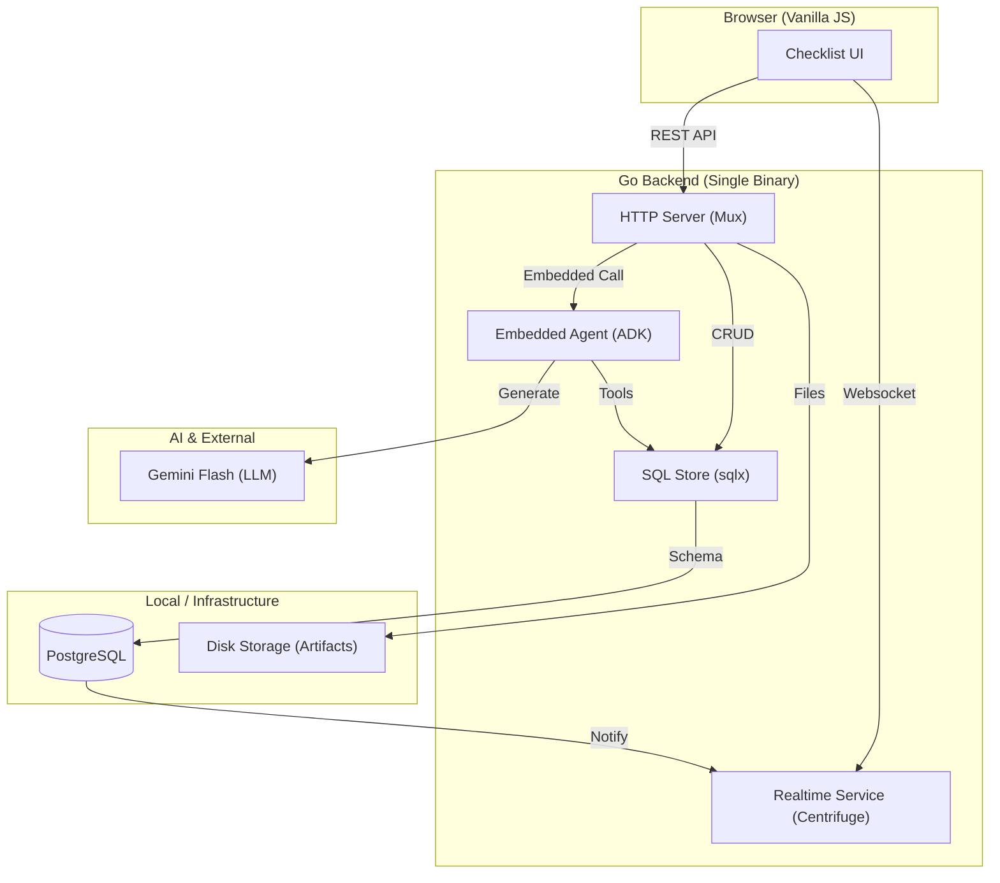

# Navallist Lite: Intelligent Boat Checklist


Navallist Lite is a collaborative, AI-enhanced boating checklist application. It is a single-binary Go application that manages trip procedures using a mobile-first web interface with real-time synchronization, voice/text commands, and photo documentation.

## Architecture Overview

Navallist Lite is designed for simplicity and ease of deployment, consolidating all features into a single process.



### 1. Unified Backend
The application runs as a single Go binary. It serves the static frontend assets, provides the REST API, and manages real-time communication via an embedded **Centrifuge** node.

### 2. Embedded ADK Agent
The "brain" of the application is an AI agent built with the **Google AI Agent Developer Kit (ADK)**. 
* It is integrated directly into the Go process using the ADK `Runner`.
* It processes natural language (voice-to-text or typed) to update the checklist.
* It uses **Gemini 2.5 Flash** for intent recognition and tool calling.

### 3. Real-time Synchronization
The system uses a Postgres `LISTEN/NOTIFY` mechanism. When any checklist item is updated (via API or Agent), a database trigger sends a notification. The Go backend listens to this and pushes the update to all connected clients via WebSockets, ensuring the whole crew sees changes instantly.

---

## Directory Structure

```text
.
├── cmd/server/             # Entry point (main.go)
├── internal/
│   ├── agent/              # ADK Agent definition, tools, and local client
│   ├── config/             # Environment configuration
│   ├── data/               # DB logic (Store, Models) & Context/Auth helpers
│   ├── realtime/           # Centrifuge hub and Postgres listener
│   └── server/             # HTTP routing and Handlers
├── migrations/             # SQL Migration files
├── web/                    # Frontend (HTML, CSS, Vanilla JS)
└── Makefile                # Development entry point
```

---

## Getting Started

### Prerequisites

* **Go**: 1.24+
* **Podman** or **Docker**: To run the local PostgreSQL database.
* **Google Gemini API Key**: [Get one here](https://aistudio.google.com/app/apikey).

### Local Development

1. **Setup Environment**
   Copy the example configuration and add your Gemini API Key:
   ```bash
   cp .env.example .env
   ```

2. **Start the Database & Migrations**
   ```bash
   make db-start
   ```

3. **Launch the Application**
   ```bash
   make run
   ```
   Open `http://localhost:8080` in your browser.

---

## Key Features

*   **Natural Language Interaction**: Use the microphone or text bar to say things like "I'm checking the life jackets" or "Sarah is assigned to the engine oil." The agent updates the specific fields automatically.
*   **Photo Documentation**: Attach photos to checklist items. Photos are stored locally and linked to the checklist for easy review.
*   **Real-time Collaboration**: As crew members check items off on their own devices, the UI updates instantly for everyone else.
*   **No Build Step**: The frontend is written in vanilla JavaScript (ES Modules). No complex build or bundling is required for development.

## License

This project is licensed under the Apache License 2.0.

*This is not an official Google product.*
