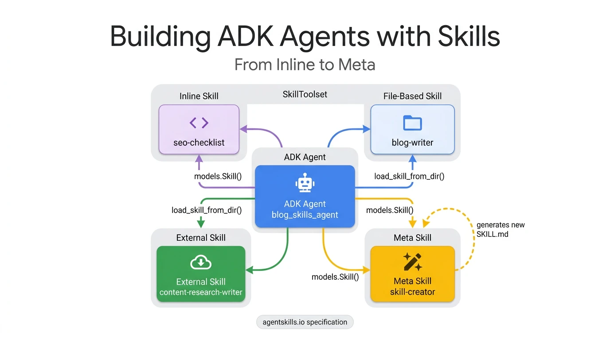
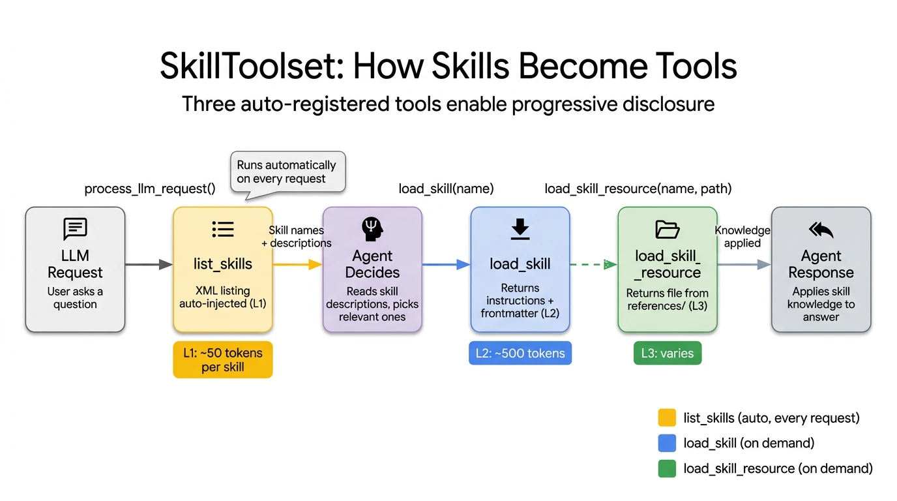

# Building ADK Agents with Skills — From Inline to Meta

Build an ADK agent that uses four different skill patterns: inline skills defined in Python, file-based skills loaded from directories, external skills pulled from community repos, and a meta skill that generates new skills on demand. Each pattern demonstrates a different tradeoff between simplicity and reusability.

<p align="center">
  
</p>

## What You'll Learn

- How ADK Skills solve context window bloat through progressive disclosure (L1/L2/L3)
- Four skill patterns: inline, file-based, external, and meta (skill-creator)
- How to wire multiple skills through a single `SkillToolset` with three auto-generated tools
- When to use each pattern based on reusability vs simplicity tradeoffs

## Prerequisites

- Python 3.11+
- [Google ADK](https://google.github.io/adk-docs/) (`pip install google-adk`)
- A Google API key ([get one here](https://aistudio.google.com/apikey))

## Quick Start

```bash
# Clone the repo
git clone https://github.com/GoogleCloudPlatform/adk-samples.git
cd adk-samples/python/agents/agent-skills-tutorial

# Set up environment
python3 -m venv .venv && source .venv/bin/activate
pip install -e .

# Configure API key
cp .env.example app/.env
# Edit app/.env with your GOOGLE_API_KEY

# Run with ADK Web UI
adk web

```

## Try It

Test these queries to see the agent in action:

| # | Query | What It Demonstrates |
|---|-------|---------------------|
| 1 | "I have a blog post titled 'Getting Started with Kubernetes'. Can you review it for SEO?" | Inline skill (seo-checklist) loaded on demand |
| 2 | "Help me write a short introduction for a blog about Python async programming. Make it SEO-friendly." | Multi-skill: blog-writer + seo-checklist loaded in parallel |
| 3 | "Can you use your video-editing skill to create a thumbnail?" | Edge case: agent handles nonexistent skill gracefully |
| 4 | "OK, then use your content research skill to help me research async Python" | External skill (content-research-writer) with resource loading |
| 5 | "I need a new skill for reviewing Python code for security vulnerabilities. Can you create a SKILL.md?" | Meta skill: skill-creator generates a new skill on demand |

## Architecture

<p align="center">
  
</p>

The agent uses a single `SkillToolset` that auto-generates three tools: `list_skills` (L1 — returns names and descriptions), `load_skill` (L2 — loads full instructions), and `load_skill_resource` (L3 — fetches reference files). This progressive disclosure pattern means the agent sees only ~200 tokens of skill metadata per LLM call, loading full instructions only when needed.

## Project Structure

```
agent-skills-tutorial/
├── app/
│   ├── __init__.py
│   ├── agent.py          # Root agent with SkillToolset wiring 4 skill patterns
│   └── skills/           # File-based skills (blog-writer, content-research-writer)
├── assets/               # Screenshots, diagrams, and demo GIF
├── .env.example          # Environment variable template
├── pyproject.toml        # Project configuration and dependencies
└── README.md
```

