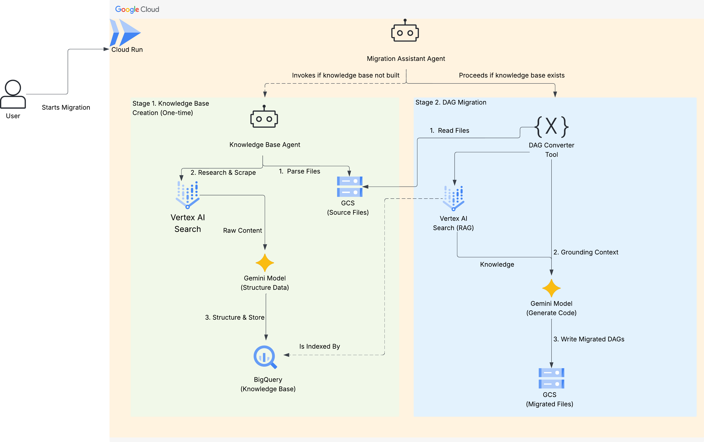

# Airflow Version Migration Agent

This project provides an intelligent, two-stage agentic system built with the Google Cloud Agent Development Kit (ADK) to automate the migration of Apache Airflow DAGs from a source version to a target version.

The system leverages Gemini models, Vertex AI Search for Retrieval-Augmented Generation (RAG), and a custom-built knowledge base in BigQuery to provide accurate, context-aware code conversions.

## Architecture Overview

The solution is composed of two primary agents that orchestrate a complex workflow:

1.  **Knowledge Base Agent (`knowledge_base_updater`)**: This agent is responsible for the one-time, intensive process of building the migration knowledge base. It's a three-step pipeline:
    *   **Parse DAGs**: Scans a GCS folder of your existing DAGs to identify the unique set of Airflow operators being used.
    *   **Research & Scrape**: For each operator, it uses Vertex AI Search (with Web Search datastore) to find relevant migration guides and documentation, then scrapes the content from these web pages.
    *   **Structure & Store**: It uses a Gemini model to analyze the scraped content, structure it into a predefined JSON schema (e.g., parameter changes, deprecation status, code examples), and stores this structured data in a BigQuery table.

2.  **Migration Assistant Agent (`airflow_migration_assistant`)**: This is the main user-facing agent.
    *   It first asks the user if the knowledge base has been built.
    *   If **yes**, it proceeds to the migration step.
    *   If **no**, it invokes the `knowledge_base_updater` agent to build the knowledge base first.
    *   For migration, it reads each source DAG file from GCS and uses a Gemini model with RAG (grounded on the BigQuery knowledge base via Vertex AI Search) to generate the migrated code, which is then saved to a destination GCS folder.

### Architectural Diagram

```text
[User] -> [Migration Assistant Agent (Cloud Run)]
  |
  + - Q: KB Exists?
      |
      + - (No) -> [Knowledge Base Agent]
      |               |
      |               1. Parse DAGs from [GCS]
      |               2. Scrape Web Content
      |               3. Structure with [Gemini] -> Store in [BigQuery]
      |               |
      |               +-> [Vertex AI Search] indexes BigQuery table
      |
      + - (Yes) -> [DAG Converter Tool]
                      |
                      1. Read DAG from [GCS Source]
                      2. Generate migrated code with [Gemini + RAG via Vertex AI Search]
                      3. Write new DAG to [GCS Destination]
```

---

## Prerequisites

Before you begin, ensure you have the following:

*   A Google Cloud Project with the Billing account enabled.
*   [Google Cloud SDK (`gcloud`)](https://cloud.google.com/sdk/install) installed and authenticated.
*   [Terraform CLI](https://developer.hashicorp.com/terraform/downloads) installed.
*   [Python 3.11+](https://www.python.org/downloads/) installed.
*   **Permissions**: We assume that all necessary Google Cloud APIs and Service Account permissions have been provisioned by an administrator. Specifically, the following APIs must be enabled:
    *   `run.googleapis.com`
    *   `iam.googleapis.com`
    *   `iamcredentials.googleapis.com`
    *   `cloudbuild.googleapis.com`
    *   `artifactregistry.googleapis.com`
    *   `secretmanager.googleapis.com`
    *   `bigquery.googleapis.com`
    *   `aiplatform.googleapis.com`
    *   `storage-component.googleapis.com`
    *   `discoveryengine.googleapis.com`
*   Additionally, ensure your deployment user/service account has the following IAM roles:
    *   Cloud Build Editor (`roles/cloudbuild.builds.editor`)
    *   Artifact Registry Admin (`roles/artifactregistry.admin`)
    *   Cloud Run Admin (`roles/run.admin`)
    *   Create Service Accounts (`roles/iam.serviceAccountCreator`)
    *   Project IAM Admin (`roles/resourcemanager.projectIamAdmin`)
    *   Service Account User (`roles/iam.serviceAccountUser`)
    *   Service Usage Consumer (`roles/serviceusage.serviceUsageConsumer`)
    *   Storage Admin (`roles/storage.admin`)

---

## Setup and Configuration

### 1. Terraform Infrastructure Provisioning

We use Terraform to quickly provision the core storage data components required by the agent (GCS buckets for your DAGs, and BigQuery for the knowledge corpus).

**Prerequisite for Remote State:**
If you choose to use the `backend "gcs"` block in `terraform/backend.tf` to store your Terraform state remotely, you **must create the bucket before running `terraform init`**. Terraform cannot create its own state bucket during initialization. 

You can create this bucket using `gcloud`:

```bash
# Create the Terraform state bucket first
gcloud storage buckets create gs://YOUR_STATE_BUCKET_NAME --location=US
```
*(Note: If you are just testing locally, you can comment out the `backend "gcs"` block in `backend.tf` to use local state instead.)*

Navigate to the `terraform/` directory and configure your variables:

```bash
cd terraform/

# Initialize Terraform (Ensure backend bucket exists if using remote state)
terraform init

# Review and apply the configuration
terraform apply
```

During the prompt, provide your `project_id`, `gcs_source_bucket_name`, and `gcs_destination_bucket_name`. 
Terraform should create the bigquery dataset and table, and the gcs buckets. Source bucket will have the sample dags from airflow 1.10 to test the agent. Destination bucket will be empty.

### 2. Create Vertex AI Datastore and Connect to BigQuery

The datastore setup is best done manually through the Google Cloud UI rather than Terraform:

1.  Go to the Google Cloud Console -> **AI Applications** > Data Stores (Vertex AI Search and Conversation).
2.  Create a new Data Store, selecting **BigQuery** as the source.
3.  Point it to the `${PROJECT_ID}.airflow_migration_kb.migration_corpus` table that Terraform just created.
4.  Set the sync frequency as your needs dictate and name the connector (e.g., `airflow-migration-connector`).
5.  Set the region as global.
6.  Note down your **Data Store ID** and **Collection ID** after linking.

### 3. Set up Vertex AI Web Search App

#### Step 1: Create the Data Store (The "Filter List")

1.  In the Google Cloud Console, go to **Vertex AI Search and Conversation** (sometimes called Agent Builder).
2.  On the left menu, click **Data Stores**, then click **+ Create Data Store**.
3.  Select **Websites**.
4.  **CRITICAL STEP:** Make sure **Advanced website indexing** is toggled **OFF**. (This is what bypasses the domain verification requirement).
5.  In the "Sites to include" box, add your URLs exactly like this (no `https://`):
    ```text
    airflow.apache.org/docs/*
    stackoverflow.com/questions/tagged/airflow/*
    medium.com/*
    ```
6.  Click **Continue**.
7.  Name your data store (e.g., `airflow-web-ds`) and click **Create**.

#### Step 2: Create the Search App (The "API Endpoint")

*Note: Basic Website Data Stores cannot be queried until attached to an App.*

1.  On the left menu, click **Apps**, then click **+ Create App**.
2.  Select **Search** as the app type.
3.  Under "Configuration":
    *   **Company name:** (Enter your company or project name)
    *   **App name:** e.g., `airflow-migration-app`
    *   **Region:** Leave as `global` (Basic Website Search requires `global`).
4.  Click **Continue**.
5.  **Link the Data Store:** You will see a list of your Data Stores. Check the box next to the `airflow-web-ds` you created in Step 1.
6.  Click **Create**.


### 4. Local Development Setup

1.  **Clone the Repository**:
    ```bash
    git clone <your-repo-url>
    cd <your-repo-folder>
    ```
2.  **Create a Virtual Environment**:
    ```bash
    python3 -m venv venv
    source venv/bin/activate
    ```
3.  **Install Dependencies**:
    ```bash
    uv sync --dev
    ```
4.  **Configure Environment**:
    *   Create a `.env` file and fill in the values with your project details (Project ID, GCS URIs, BigQuery details, Vertex AI Web Search configs, etc.).

### Alternative: Using Agent Starter Pack

You can also use the [Agent Starter Pack](https://goo.gle/agent-starter-pack) to create a production-ready version of this agent with additional deployment options:

```bash
# Create and activate a virtual environment
python -m venv .venv && source .venv/bin/activate # On Windows: .venv\Scripts\activate

# Install the starter pack and create your project
pip install --upgrade agent-starter-pack
agent-starter-pack create my-airflow-migration-agent -a adk@airflow_version_upgrade_agent
```

<details>
<summary>⚡️ Alternative: Using uv</summary>

If you have [`uv`](https://github.com/astral-sh/uv) installed, you can create and set up your project with a single command:
```bash
uvx agent-starter-pack create my-airflow-migration-agent -a adk@airflow_version_upgrade_agent
```
This command handles creating the project without needing to pre-install the package into a virtual environment.

</details>

The starter pack will prompt you to select deployment options and provides additional production-ready features including automated CI/CD deployment scripts.

### 5. Running the Agent Locally

Authenticate your local environment and run the ADK server:

```bash
# Authenticate
gcloud auth application-default login

# Make a call to adk web from the **agents/airflow_agents** directory
adk web
```

You can now interact with your agent in the ADK web UI, typically at `http://127.0.0.1:8000`.

---

## Deployment to Cloud Run

This agent is designed to be deployed as a containerized service on Cloud Run via the Agent Development Kit (ADK).

1. Set Deployment Variables:

The variables needed for the deployment are captured in the `.env.example` file. 

Copy the example file to `.env` and configure your variables:

```bash
cp .env.example .env
# Open .env and fill in your details (PROJECT_ID, GOOGLE_CLOUD_LOCATION, SERVICE_NAME, etc.)
# Make sure to source your env variables before proceeding, or let your deployment pipeline load them.
source .env
```

2. Deploy to Cloud Run: 

Deploy the container, passing configuration as environment variables.

```bash
# Run this command from your **`agents`** directory

adk deploy cloud_run \
--project=$PROJECT_ID \
--region=$GOOGLE_CLOUD_DEPLOY_LOCATION \
--service_name=$CLOUD_RUN_SERVICE_NAME \
--app_name=$CLOUD_RUN_APP_NAME \
--with_ui \
--port 8000 \
$AGENT_PATH
```

During the deployment process, you might be prompted: `Allow unauthenticated invocations to [your-service-name] (y/N)?`.
* Enter `y` to allow public access to your agent's API endpoint without authentication.
* Enter `N` (or press Enter for the default) to require authentication.

Upon successful execution, the command will deploy your agent to Cloud Run and provide the URL of the deployed service.

---

## UI Testing

### Get an identity token (if needed)
```bash
export APP_URL="YOUR_CLOUD_RUN_SERVICE_URL"
export TOKEN=$(gcloud auth print-identity-token)
```

### List Apps
```bash
curl -X GET -H "Authorization: Bearer $TOKEN" $APP_URL/list-apps
```

### Create or Update a Session
Initialize or update the state for a specific user and session. Replace $APP_NAME with your actual app name if different.

```bash
curl -X POST -H "Authorization: Bearer $TOKEN" \
    $APP_URL/apps/$APP_NAME/users/user_123/sessions/session_abcd \
    -H "Content-Type: application/json" \
    -d '{"state": {"preferred_language": "English", "visit_count": 5}}'
```

### Run the Agent
Send a prompt to your agent. Adjust the user/session IDs and prompt as needed.

```bash
curl -X POST -H "Authorization: Bearer $TOKEN" \
    $APP_URL/run_sse \
    -H "Content-Type: application/json" \
    -d '{
    "app_name": "airflow_version_upgrade_app",
    "user_id": "user_123",
    "session_id": "session_abcd",
    "new_message": {
        "role": "user",
        "parts": [{
        "text": "Help me migrate airflow"
        }]
    },
    "streaming": false
    }'
```

Set `"streaming": true` if you want to receive Server-Sent Events (SSE).


## Demo Run Example

### How to access the agent:
1. Navigate to your **Cloud Run Services** in the Google Cloud Console.
2. Click on the deployed application URL for the `airflow-migration-agent`.
3. This will open the ADK web interface and start a new chat session.
4. Begin a conversation with the agent using the chat interface!

### Example Conversation Flow

Here is a step-by-step example of a successful interactive migration session:

**🧑 User:** 
> Hi

**🤖 Agent:** 
> *[Introduces itself and asks for details to upgrade to the next version]*
> 1. Do you have a knowledge base created already? 
> 2. If not, I can create it for you with the required inputs.

**🧑 User:** 
> No, help me create one.

**🤖 Agent:** 
> *[Asks for the details required to create a knowledge base]*
> Please provide:
> 1. GCS URI where your input DAGs reside
> 2. Source Airflow version
> 3. Destination Airflow version
> 4. Your Google Cloud Project ID

**🧑 User:** 
> ```text
> source_airflow_version="1.10.5"
> target_airflow_version="2.10"
> source_gcs_uri="gs://<your-source-bucket-name>/dags/"
> project_id="<project-id>"
> ```

**🤖 Agent:** 
> *[Invokes the 3-stage knowledge-building process (detailed in the operational guide). Once completed, it verifies the outcome]*
> The knowledge base has been built! Would you like to proceed with the migration, or stop here?

**🧑 User:** 
> Yes, let's proceed with migration.
> ```text
> destination_gcs_uri="gs://<your-destination-bucket-name>/output/"
> project_id="<project-id>"
> collection_id="<collection-id>"
> data_store_id="<datastore-id>"
> ```

**🤖 Agent:** 
> *[Executes the DAG conversion using RAG and grounded responses]*
> Migration complete! The output GCS bucket now contains your migrated DAGs.
