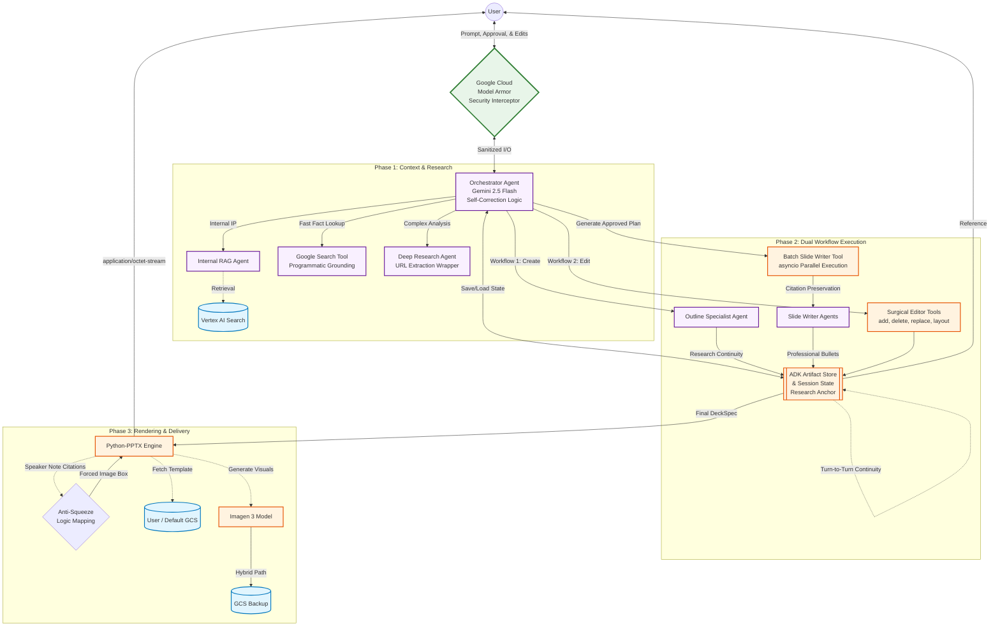

# Presentation Expert Agent - Architecture Diagram

This document illustrates the high-level multi-agent architecture of the Presentation Expert Agent. It highlights the unified data model, programmatic grounding for research, and enterprise-grade state persistence.

### Architectural Highlights

1. **Research Continuity & Integrity:** To ensure 100% citation consistency, the system implements a **Research Anchor** logic. Once research is conducted in Phase 1, the resulting facts and raw URLs are locked into the session state. Subsequent outline revisions or slide generations strictly reuse this "Ground Truth" to prevent source links from being lost or summarized away.
2. **Programmatic Grounding Extraction:** Rather than relying on the LLM to manually copy-paste URLs, the `google_research_tool` and `deep_research_tool` use custom `FunctionTool` wrappers. These wrappers programmatically intercept the model's response and extract verified source URIs directly from the tool's grounding metadata, ensuring data provenance is never lost.
3. **Stateless State Persistence:** The agent uses a combination of the **ADK Artifact Store** (for physical JSON plans) and **Session State** (for transient research summaries). This hybrid persistence ensures that complex presentations survive cloud worker node rotations and long-running research tasks.
4. **Unified Data Model (`slides`):** To prevent model confusion and "Malformed Function Call" errors, the entire system uses a single consistent data structure. The same `SlideSpec` model is used for planning (focus instruction), interactive revisions, and final output (professional bullets).
5. **Anti-Squeeze Layout Safety:** The rendering engine features a **Smart Layout Guard**. It automatically overrides "squeezed" layout requests (like "Title and Chart") and remaps them to professional alternatives (like "Title and Image") while automatically appending all citations to the slide's speaker notes.
6. **Parallel Content Generation:** Latency is minimized by offloading synthesis to the `batch_slide_writer_tool`, which utilizes Python's `asyncio.gather` to generate detailed content for an entire deck concurrently.
