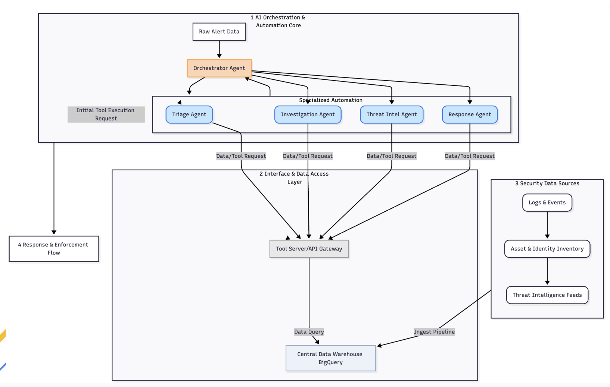

# 🛡️ Cyber Guardian Agent

## A. Overview & Functionalities

### 📋 Agent Details

| Attribute | Description |
| :--- | :--- |
| **Interaction Type** | ⚙️ **Workflow** (Structured step-by-step execution with conditional routing) |
| **Complexity** | 🧠 **Advanced** (Multi-agent orchestration, conditional logic, tool piping) |
| **Agent Type** | 👥 **Multi-Agent System** (Hierarchical Orchestrator with 4 Specialized Sub-agents) |
| **Vertical** | 🔒 **Cybersecurity / Security Operations (SecOps)** |

---

### ✨ Key Features

The Cyber Guardian Agent leverages a **hierarchical multi-agent architecture** built on Google's Agent Development Kit (ADK) to automate incident triage, investigation, and response.

#### 🧠 1. Orchestration & Routing
*   **Orchestrator Agent**: Acts as the central brain. It parses raw alert data (e.g., EDR detections, Phishing emails, IOC matches) and manages the execution flow.
*   **Dynamic Paths**: It intelligently reroutes the investigation path based on evidence. For instance, it runs **Threat Intel** *before* **Investigation** for IOC alerts, but *after* **Investigation** for process-heavy EDR alerts to verify newly discovered indicators.

#### 🛠️ 2. Specialized Python Tools
*   **Native Python Integration**: All forensic and investigative tools are implemented as standard Python functions, integrated via ADK's `FunctionTool`. This ensures low latency and seamless data passing between agents.
*   **BigQuery Integration**: Tools are optimized to query high-capacity BigQuery tables for logs, asset inventory, and threat intelligence, effectively serving as a high-speed RAG (Retrieval-Augmented Generation) source for security context.

#### 👥 3. Specialized Sub-Agents
*   **Triage Agent**: Handles deduplication and context enrichment. It queries asset inventory to determine if the target is a high-criticality asset.
*   **Investigation Agent**: Digs deep into process and network logs to confirm the blast radius and derive new Indicators of Compromise (IOCs).
*   **Threat Intel Agent**: Performs batch lookups on file hashes, IPs, and domains against a threat intelligence knowledge base.
*   **Response Agent**: Maps findings to predefined playbooks and recommends surgical response actions.


---

## B. Architecture Visuals



---

## C. Setup & Execution

### 🛠️ Prerequisites & Installation

Follow these steps to set up the environment, authenticate, and run the agent.

**1. Clone the Repository**
This agent is part of the `adk-samples` repository. You can clone the repository and navigate to the agent directory:
```bash
git clone https://github.com/google/adk-samples.git
cd adk-samples/python/agents/cyber-guardian-agent
```
*(Note: If you are already in this directory, you can skip this step).*

**2. Google Cloud Authentication**
The agent requires access to BigQuery and Vertex AI. Authenticate your local environment:
```bash
gcloud auth application-default login
```

**3. Python Environment Setup**
Create and activate a virtual environment:
```bash
python -m venv .venv
source .venv/bin/activate
```

**4. Configure Environment Variables (.env)**
The agent uses environment variables for project-specific configurations. Create a `.env` file inside the cyber guardian folder
You can copy the .env.example file and update the values. 

**Example `.env` configuration:**
```env
GOOGLE_GENAI_USE_VERTEXAI=1
GOOGLE_CLOUD_PROJECT="your-gcp-project-id"
GOOGLE_CLOUD_LOCATION="your-gcp-region"
BQ_DATASET="<your_bq_dataset>"
MODEL_ID="model_id"
```

> [!IMPORTANT]
> Ensure `GOOGLE_CLOUD_PROJECT` matches your actual GCP project ID where the BigQuery tables are hosted. 

**5. Running the Agent

You can interact with the Cyber Guardian Agent through a web interface or directly via the command line.

#### Option 1: Web UI (Recommended)
Launch the ADK web interface to visualize the multi-agent workflow and tool calls.
```bash
adk web --port 8081
```
Open `http://localhost:8081` in your browser and select the `cyber_guardian_orchestrator` agent.

#### Option 2: CLI (Direct Execution)
Run the agent directly from the terminal for quick testing.
```bash
adk run cyber_guardian:root_agent --input "Raw alert text here..."
```

**Example Test Query:**
```bash
adk run cyber_guardian:root_agent --input "IOC_Match: hostname: kvm01, user: admin, ip_address: 192.168.1.50, IOC: high_risk_hash_123 ........."
```
---


#### 🧪 Testing with Sample Inputs
You can make use of the sample inputs available in `sample_input.txt` for testing the agent in the ADK web interface.
Open `sample_input.txt` to find examples like:
*   **Sample Input 1**: EDR Detection (New - Malicious PowerShell)
*   **Sample Input 2**: IOC Match (New - Malicious IP)
*   **Sample Input 3**: Phishing Email (New - Malicious Domain)

Copy the raw alert text or the content described in the sample input and paste it into the chat input of the ADK web UI to see how the agent orchestrates the sub-agents and tools to handle the incident.

