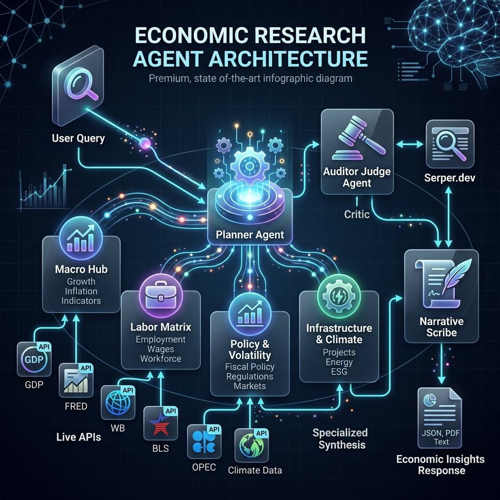
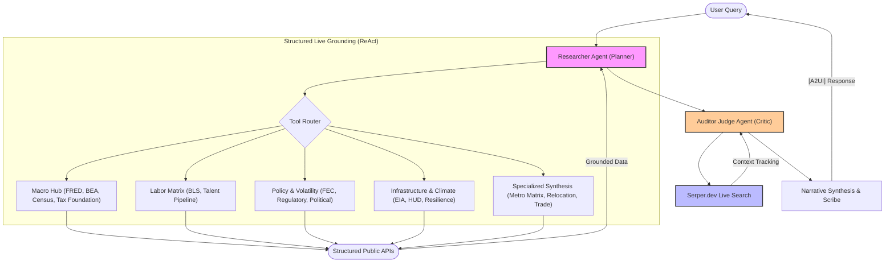

# 🧠 Economic Research Agent (ERA)

[](https://github.com/GoogleCloudPlatform/agent-starter-pack)
[](https://github.com/GoogleCloudPlatform/agent-starter-pack)
[](https://github.com/google/adk)
[](#)

An enterprise-grade, **Multi-Agent intelligence** for high-fidelity regional economic analysis, labor market evaluation, and cross-industry site selection. Upgraded to **Vertex AI Agent Engine (ADK 2.1+ / AdkApp)** with a 100% Live-API grounded architecture and **Zero LangChain/LangGraph dependencies** for massive speed-up.

---

## A. Overview & Functionalities

The **Economic Research Agent (ERA)** is a production-grade site-selection and market intelligence consultant. Designed for corporate research, ERA automates comparative metropolitan cost-modeling by orchestrating live public APIs (FRED, BLS, CENSUS, HUD, EIA) into McKinsey-style strategic briefs—now upgraded with an automated **Auditor Judge Agent** (via Serper Live Search) for zero-hallucination verification.

### 📊 Agent Details

| Feature | Specifics |
| :--- | :--- |
| **Interaction Type** | Conversational / Strategic Consultant |
| **Complexity** | Advanced (Multi-Source Synthesis) |
| **Agent Type** | Single Agent (ADK Class-Based) |
| **Vertical** | Economic Development / Real Estate / Finance |
| **Grounding** | 100% Live-API (FRED, BLS, HUD, Census, BEA) |

### 💬 Example Interaction (Strategic Consulting)

**User**: "Compare Austin and Raleigh for a new data center HQ."

**ERA**: "I am analyzing technical and fiscal ROI for NAICS 518210 (Data Processing). 
1. **Utility Benchmarking**: Texas (ERCOT) industrial rates average 8.2c/kWh, while North Carolina (Duke Energy) is 7.5c/kWh.
2. **Talent Pipeline**: UT Austin graduated 1,200 CS majors in 2023 vs. 850 from NC State.
3. **Fiscal Climate**: NC has a scheduled corporate tax phasedown to 0% by 2030, offering a better longitudinal OPEX profile.
*Recommendation: Raleigh for long-term tax stability; Austin for immediate talent density.*"

### 💎 Consultant's Playbook: The "WOW" Matrix

| Source | Strategic "WOW" Query | Consultative Insight |
| :--- | :--- | :--- |
| **FRED** | "What is the 10-year unemployment trend for Austin vs. Nashville?" | Longitudinal Labor Resilience |
| **BEA** | "Compare the Real GDP growth rate for the San Francisco MSA vs. Dallas." | Macroeconomic Momentum |
| **Census** | "Show the educational attainment (Bachelor's+) pipeline for Seattle vs. Raleigh." | Talent Depth & Engineering Density |
| **HUD** | "Is Austin affordable for a 50% AMI workforce? Correlate rent vs income." | Workforce Retention & COLA Risk |
| **BLS** | "What is the 10-year wage trend vs. unionization in the Rust Belt?" | Labor Cost & Structural Risk |
| **FEC** | "Benchmark the political stability of site selection in Ohio using FEC data." | Political Volatility & Lobbying Exposure |
| **USITC** | "Analyze Arizona as a semiconductor hub. Show trade flows vs state tax rates." | Supply Chain Dependency (Chips) |
| **EIA** | "Compare industrial electricity rates in Texas vs. Ohio for a data center." | Operational Utility Benchmarking |
| **Register** | "Are there any recent regulatory notices regarding semiconductors in Texas?" | Live Regulatory Drift & Compliance |
| **Tax F.** | "What are the corporate income tax brackets for North Carolina in 2024?" | Fiscal Competitiveness |
| **Combined** | "Create a Metro Matrix comparing Denver and Seattle for a new Tech Hub." | 360-Degree Site Selection (Level 3) |

### 📡 Consultative Capabilities

#### 💼 Labor & Macro (FRED/BLS)
- **Live Wage Analysis**: Real-time median hourly wages fetched via live FRED search (No hardcoded mocks).
- **Unemployment Trends**: 10-year historical time-series sampling for MSA-level analysis.
- **Union Density**: Live state-level union membership percentages.

#### 🏢 Real Estate & Utilities (CoStar/EIA)
- **Energy Matrix**: Live Industrial electricity rates (per kWh) using compliant EIA `IND` sector codes.
- **ROI Modeling**: Real estate acquisition ROI based on live macro health indicators.

#### 🗳️ Policy & Political Risk (FEC/LDA/OpenSecrets)
- **Campaign Finance**: Correlate political stability with corporate and PAC contribution data.
- **Lobbying Hubs**: Identification of industry influence and regulatory engagement levels.
- **Regulatory Monitoring**: Live notices from the **Federal Register** regarding industry-specific policy shifts.

#### 🏠 Housing & Affordability (HUD/Census)
- **Workforce Burden Analysis**: Correlation of Fair Market Rents (FMR) against Area Median Income (AMI).
- **Relocation COLA**: Precise cost-of-living benchmarking for talent retention strategy.
- **Demographic Depth**: Hyper-localized education and age-bucket analysis (Census ACS).

---

## B. Architecture Visuals





---

## C. Setup & Execution

### 🔑 API Configuration (.env)

The ERA uses a modular grounding strategy. Set these in your `.env` file (see `.env.example`).

| Service | Category | Status | Signup Link |
| :--- | :--- | :--- | :--- |
| **FRED** | Macro & Labor | **Required** | [Sign up for FRED API](https://fredaccount.stlouisfed.org/login/secure/apikeys) |
| **BEA** | GDP & Income | **Required** | [Sign up for BEA API](https://apps.bea.gov/api/signup/index.cfm) |
| **BLS** | Labor Stats | **Required** | [Sign up for BLS API](https://data.bls.gov/registrationEngine/) |
| **Census** | Demographics | **Required** | [Sign up for Census API](https://api.census.gov/data/key_signup.html) |
| **HUD** | Affordability | **Required** | [Sign up for HUD API](https://www.huduser.gov/portal/dataset/fmr-api.html) |
| **FEC** | Political Risk | **Required** | [Sign up for FEC API](https://api.open.fec.gov/) |
| **EIA** | Energy & Power | **Optional** | [Sign up for EIA API](https://www.eia.gov/opendata/register.php) |
| **NewsAPI** | Sentiment | **Optional** | [Sign up for NewsAPI](https://newsapi.org/register) |
| **Serper** | Live Judge Search | **Optional** | [Sign up for Serper.dev](https://serper.dev/) |
| **CDC** | Healthcare Stats | **Optional** | [Sign up for CDC Data](https://data.cdc.gov/) |

### 🛠️ Installation

ERA uses `uv` for lightning-fast dependency management.

```bash
# Create and synchronize the virtual environment
uv sync --dev
```

### Alternative: Using Agent Starter Pack

You can also use the [Agent Starter Pack](https://goo.gle/agent-starter-pack) to create a production-ready version of this agent with additional deployment options:

```bash
# Create and activate a virtual environment
python -m venv .venv && source .venv/bin/activate # On Windows: .venv\Scripts\activate

# Install the starter pack and create your project
pip install --upgrade agent-starter-pack
agent-starter-pack create my-economic-research-agent -a adk@economic-research-agent
```

<details>
<summary>⚡️ Alternative: Using uv</summary>

If you have [`uv`](https://github.com/astral-sh/uv) installed, you can create and setup your project with a single command:
```bash
uvx agent-starter-pack create my-economic-research-agent -a adk@economic-research-agent
```
This command handles creating the project without needing to pre-install the package into a virtual environment.

</details>

The starter pack will prompt you to select deployment options and provides additional production-ready features including automated CI/CD deployment scripts.

### 🚀 Running the Agent

ERA offers multiple interaction protocols:

```bash
# 🧠 Option 1: Interactive CLI Session (Standard)
make run

# 🛰️ Option 2: Multi-Protocol MCP Server (For Claude/Cursor)
make mcp
```

---

## D. Customization & Extension

The ERA is designed for modular growth:
- **Modifying the Persona**: Edit `economic_research/prompt.py` to change the consultative tone.
- **Adding New Skills**: Add your skill in `economic_research/tools/`, then register it in `economic_research/agent.py`.
- **Altering Data Flows**: Use the `shared_libraries/helper.py` to add new HTTP/JSON normalization patterns for regional data.

---

## E. Evaluation

How do we know ERA is accurate?
- **Golden Suite**: We use a 21-question integration suite (`tests/integration/`) targeting specific NAICS scenarios.
- **Grounding Fidelity Metric**: The `eval/run_eval.py` script uses **LLM-as-a-Judge** (Gemini 3.1 Pro) to verify if the output contains actual numerical data from the APIs.
- **Regression Testing**: `pytest` handles unit-level verification of API response parsing.

```bash
# Run the full 21-question validation suite
uv run pytest tests/integration/test_full_golden_suite.py
```

---

## F. Deploy

### 🚀 Production Rollout

The ERA is built for the **Vertex AI Reasoning Engine** (ADK 2.0).

```bash
# 🌍 Step 1: Deploy to Google Cloud (Reasoning Engine)
make deploy
```

### 🔒 Cloud-Native Security & Privacy

The ERA is engineered for **Enterprise Privacy** within the Google Cloud perimeter:
- **Zero Data Retention**: No local databases or static tables are used. Data is processed in-memory.
- **Key-Safe Architecture**: Secrets are managed via `.env` or Google Secret Manager.

---

*Built for the Atomic Agents Initiative.*
