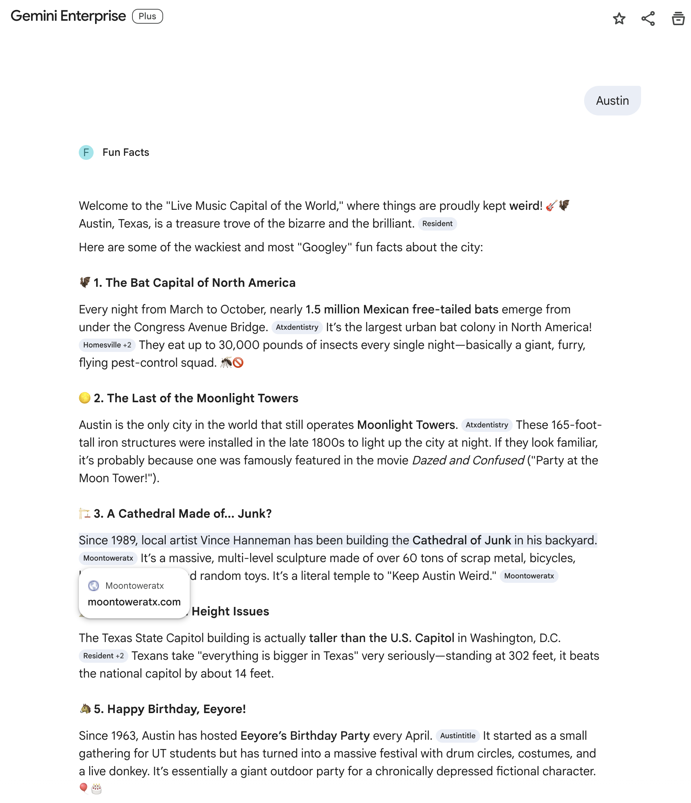

# Fun Facts Agent

This is a simple agent built using Google Agent Development Kit (ADK). It is designed to be as simple as possible to help you get familiar with ADK tools, deployment to Vertex AI Agent Engine, and accessing agents through Gemini Enterprise.

The agent uses the **Gemini** model and **Google Search** grounding to provide wacky and interesting fun facts about any topic you provide.

## Project Structure

- `fun_facts/agent.py`: Contains the `root_agent` definition and the `App` configuration.
- `pyproject.toml`: Lists the Python dependencies and project metadata.
- `.env.example`: Template for required environment variables.

## Prerequisites

- **Python 3.10+**
- **Google Cloud Project** with the [Vertex AI API](https://console.cloud.google.com/apis/library/aiplatform.googleapis.com) enabled.
- **gcloud CLI** installed and authenticated (`gcloud auth application-default login`).
- **ADK CLI** installed (`pip install google-adk`).
- **uv** installed ([Install uv](https://docs.astral.sh/uv/getting-started/installation/)).

## Setup

1. **Install Dependencies:**
   From this directory, run:

   ```bash
   uv sync
   ```

2. **Configure Environment:**
   Copy the example environment file and fill in your Google Cloud Project ID:

   ```bash
   cp .env.example fun_facts/.env
   ```

   Edit `.env` to set your `GOOGLE_CLOUD_PROJECT`.

## Local Development

You can interact with your agent locally using the ADK CLI tools:

- **Terminal:** Run the agent directly in your terminal.

  ```bash
  adk run fun_facts
  ```

- **Web UI:** Launch a local web interface to chat with the agent and inspect its execution trace.

  ```bash
  adk web
  ```

## Deployment to Vertex AI Agent Engine

Deploying your agent to Google Cloud allows it to be used as a managed service.

NOTE: For this agent, `--region` must be passed explicitly because the Gemini model requires the `global` endpoint, but Agent Engine must be deployed to a regional endpoint (e.g. `us-central1`).

```bash
adk deploy agent_engine fun_facts --region="us-central1"
```

This command will package your agent, upload it to Vertex AI, and create an **Agent Engine** resource.

The resource name will look something like this:

```none
projects/PROJECT_NUMBER/locations/us-central1/reasoningEngines/AGENT_ENGINE_ID
```

You can view Agent Engine resources in the Cloud Console here: <https://console.cloud.google.com/vertex-ai/agents/agent-engines>.

## Accessing via Gemini Enterprise

Once deployed to Agent Engine, your agent can be made available to users in your organization through [Gemini Enterprise](https://cloud.google.com/gemini-enterprise):

- Follow the steps in the documentation to [Register and manage ADK agents hosted on Vertex AI Agent Engine](https://docs.cloud.google.com/gemini/enterprise/docs/register-and-manage-an-adk-agent#register-an-adk-agent)


