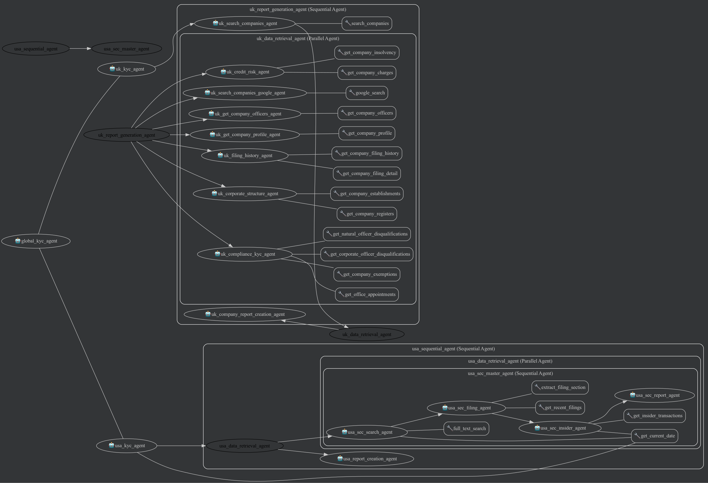
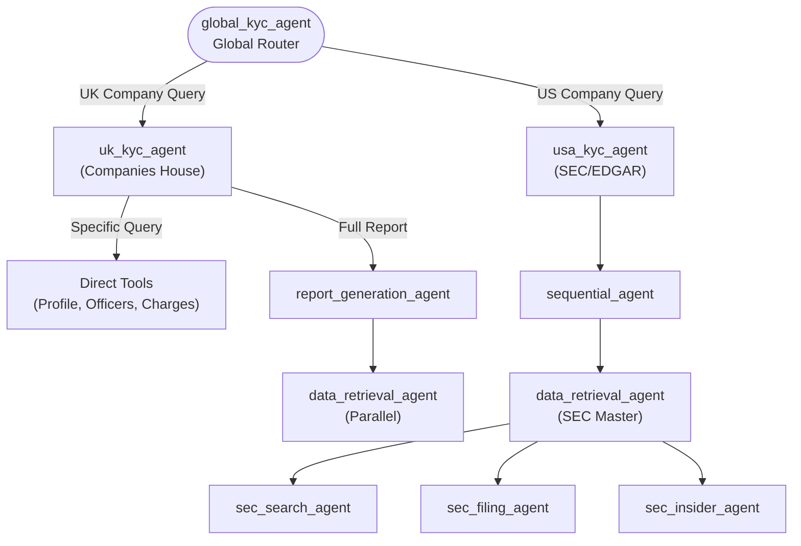

# Global KYC / Compliance Agent

This project provides a unified conversational agent powered by the Google ADK framework that handles compliance and Know Your Customer (KYC) queries for both UK and US companies.

## A. Overview & Functionalities

### Agent Details Table
| Feature | Description |
| :--- | :--- |
| **Interaction Type** | Conversational |
| **Complexity** | Advanced |
| **Agent Type** | Multi-Agent |
| **Vertical** | Finance & Compliance |
| **Key Features** | **Google ADK Framework**: Parallel and Sequential agent orchestration.<br>**Routing**: Dynamic dispatch between UK and USA sub-agents based on the geographical context of the query.<br>**Tools**: Direct integration with Companies House (UK) and SEC EDGAR APIs (USA) for real-time live data retrieval.<br>**State Management**: Accurately tracks context for reporting multi-turn compliance queries. |

### Example Interaction
**User:** "Perform a compliance check on Google UK Limited."
**Agent:** *Routing request to UK KYC Agent... Retrieving company profile, active officers, and filing history from Companies House...*
**Agent:** "Google UK Limited (Company number 03977902) is currently an active private limited company incorporated on May 23, 2000. Here are the active officers..."
**User:** "Great. Can you now check Tesla's recent insider trading?"
**Agent:** *Routing request to USA KYC Agent... Searching SEC for recent Form 4 filings for TSLA...*
**Agent:** "Over the past 30 days, there have been 5 insider trading transactions recorded for Tesla Inc. (TSLA). Based on the recent Forms 3, 4, and 5 filed..."

## B. Architecture Visuals

The project features a `global_kyc_agent` root router that delegates to either the UK or US sub-agent based on the company's geographical location or user request context. 





## C. Setup & Execution

### Prerequisites & Installation

1. **Python Environment**: Ensure you have Python 3.12 installed (as required by the ADK dependencies).
2. **Clone the repository and install dependencies:**
   ```bash
   git clone https://github.com/your-username/kyc-agent-adk.git
   cd kyc-agent-adk
   uv sync --dev
   ```
3. **Set up Authentication & Configuration:**
   Copy the example environment variables file and configure it:
   ```bash
   cp .env.example .env
   ```
   
   The agent utilizes **Vertex AI** for Gemini access. Instead of an API key, you must authenticate using Google Cloud Application Default Credentials (ADC):
   ```bash
   gcloud auth login
   gcloud auth application-default login
   ```
   
   *Required Keys/Vars in `.env`:*
   - `GOOGLE_CLOUD_PROJECT`: Set this to your Google Cloud Project ID.
   - `COMPANIES_HOUSE_API_KEY`: For UK agent data components.
   - `SEC_API_KEY`: For US agent data components.

### Running the Agent

You can start the agent via the terminal:
```bash
python3.12 main.py
```

Alternatively, you can test it directly within the robust, built-in ADK Web UI:
```bash
adk web
```
This will open a new tab in your web browser with the ADK UI, allowing you to trace execution flows, tool trajectories, and test variables.

### Alternative: Using Agent Starter Pack

You can also use the [Agent Starter Pack](https://goo.gle/agent-starter-pack) to create a production-ready version of this agent with additional deployment options:

```bash
# Create and activate a virtual environment
python -m venv .venv && source .venv/bin/activate # On Windows: .venv\Scripts\activate

# Install the starter pack and create your project
pip install --upgrade agent-starter-pack
agent-starter-pack create global-kyc-agent -a adk@global_kyc_agent
```

<details>
<summary>⚡️ Alternative: Using uv</summary>

If you have [`uv`](https://github.com/astral-sh/uv) installed, you can create and set up your project with a single command:
```bash
uvx agent-starter-pack create global-kyc-agent -a adk@global_kyc_agent
```
This command handles creating the project without needing to pre-install the package into a virtual environment.

</details>

The starter pack will prompt you to select deployment options and provides additional production-ready features including automated CI/CD deployment scripts.

## D. Customization & Extension

- **Modifying the Flow:** The core routing logic rests in `global_kyc_agent/agent.py` and its prompt in `global_kyc_agent/prompt.py`. Sub-agent specifics are separated in the `global_kyc_agent/sub_agents/` directory (e.g., `uk_kyc/` and `usa_kyc/`). Adjust instruction variables or edit the routing logic inside these files.
- **Adding Tools:** Define your new python functions following the ADK Tool standard. Place them locally within the `global_kyc_agent/tools/` or individual sub-agent folders, and simply append them to the `tools` array upon initializing an agent.
- **Changing Data Sources:** If you require changing from web-based endpoints to internal implementations, internal SQL databases, or vector stores for RAG, modify the retrieval functions inside your tools. Make sure to update your agent's system prompt instructions to adapt to any schema differences arising from internal queries.

## E. Evaluation

Evaluations form the backbone for validating our multi-agent framework effectively routing execution pathways and preventing hallucinations during tasks. 

### Methodology and Metrics
Our evaluation methodology assesses two major metrics configuring the `eval_config.json`:
1. **Tool Trajectory (`tool_trajectory_avg_score`)**: Verifies that the agent logic called the correct tools internally during resolving user compliance checks (e.g., verifying that for 10-K reviews, `extract_filing_section` is dispatched). Set dynamically to `ANY_ORDER` or `EXACT_MATCH` based on requirements.
2. **Response Matching**: Confirms the final synthesis of unstructured data extracted contains truthful facts mapping back to origin sources without making up details.

### Running Evaluations
Evaluation fixtures are stored in the `/eval/` folder, and configuration parameters are loaded from `eval_config.json`.
You can run evaluation metrics directly using the `adk eval` command:
```bash
adk eval global_kyc_agent eval/global_kyc.test.json --config_file_path eval_config.json --print_detailed_results
```
*(Tip: Export variables like `MOCK_SEC_API=true` to circumvent rate limitations from API providers during tests).*

Custom debugging scripts are included at the root to process outputs during test discrepancies:
- `python3.12 parse_eval.py`: Summarizes tool errors across multiple JSON evaluation logs.
- `python3.12 fix_eval.py`: Aids in normalizing sequence mappings inside failing tool trajectories for the Google ADK runner.

## F. Deploy

For the agent to be deployable, follow the instructions [here](https://cloud.google.com/vertex-ai/generative-ai/docs/agent-engine/deploy-agent). 

To deploy the unified agent construct to Google Cloud's Vertex AI Agent Engine directly using the ADK CLI:
```bash
adk deploy --project YOUR_PROJECT_ID --agent global_kyc_agent.agent:root_agent --name global-kyc-agent
```

### Using a Service Account for Deployment

To deploy using a dedicated Service Account (e.g., in a CI/CD pipeline or for restricted access), authenticate with the Service Account before running the deploy command:

```bash
# 1. Activate the Service Account
gcloud auth activate-service-account --key-file=/path/to/your/service-account-key.json

# 2. Run the deployment
adk deploy --project YOUR_PROJECT_ID --agent global_kyc_agent.agent:root_agent --name global-kyc-agent
```

Ensure the Service Account holds the required permissions for Vertex AI Agent Engine deployment (e.g., `roles/aiplatform.admin`, `roles/compute.admin`, or custom roles for Reasoning Engines).
