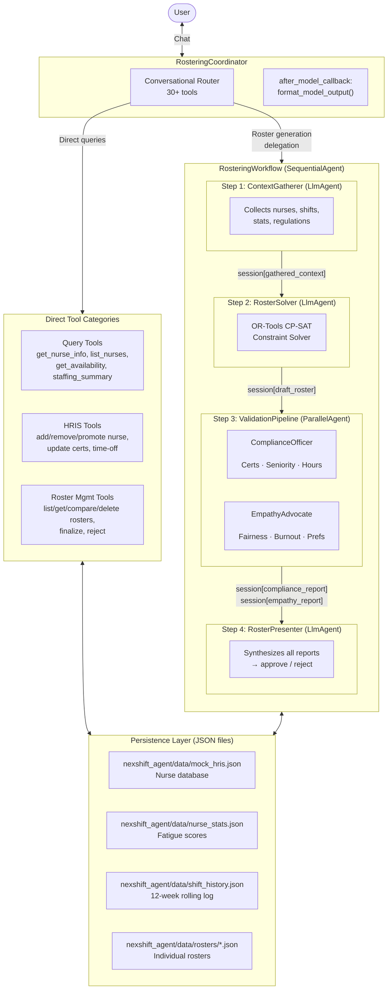
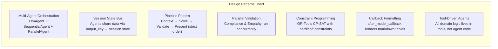
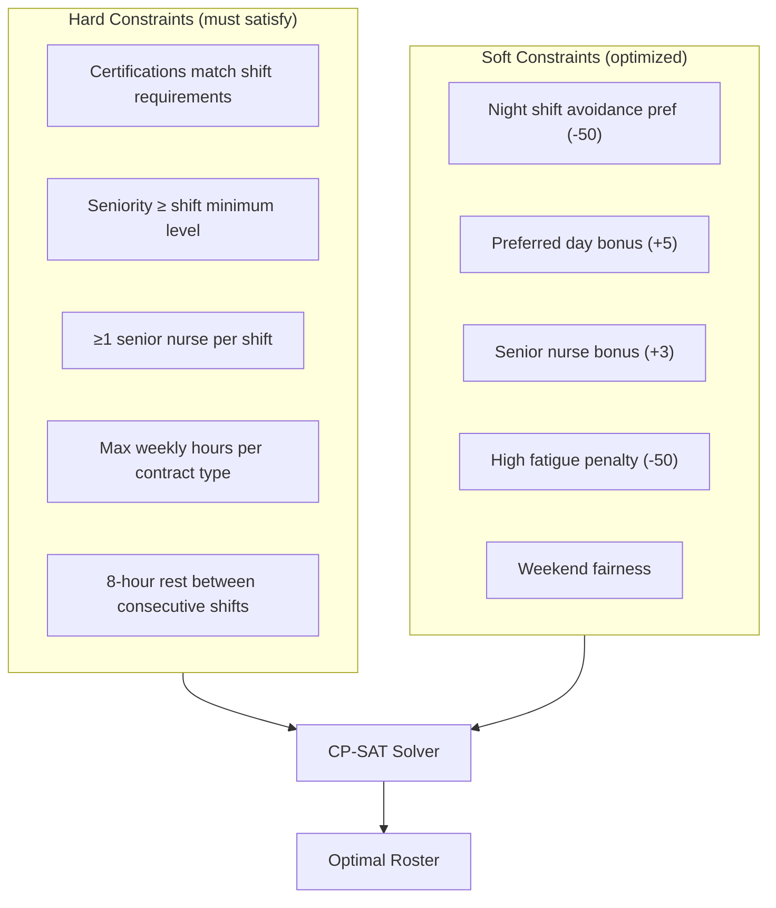

# NexShift

**Solve the Staffing Puzzle Instantly with AI Optimization.**

NexShift is an AI-powered nurse rostering agent built on Google's Agent Development Kit (ADK). It uses a multi-agent architecture to generate, validate, and manage optimal nurse schedules — balancing hard regulatory constraints with human-centric fairness considerations through OR-Tools constraint programming.

---

## A. Overview & Functionalities

### Agent Details

| Field            | Details                                                                 |
|------------------|-------------------------------------------------------------------------|
| **Interaction Type** | Conversational (chat-based queries, approvals, HRIS commands) + Workflow (automated roster generation pipeline) |
| **Complexity**       | Advanced                                                            |
| **Agent Type**       | Multi-Agent (6 specialized sub-agents with sequential + parallel orchestration) |
| **Vertical**         | Healthcare — Hospital Nurse Scheduling                              |

### Key Features

| Component           | Description |
|---------------------|-------------|
| **Coordinator** | Root orchestrator with 30+ tools for queries, HRIS management, roster lifecycle, and delegation to the generation workflow. |
| **SequentialAgent Workflow** | Enforces a strict 4-step pipeline: Context Gathering → Solving → Validation → Presentation. |
| **OR-Tools Solver** | Constraint programming engine (CP-SAT) that generates optimal rosters respecting certifications, seniority, hours, rest periods, and nurse preferences. |
| **Parallel Validation** | Compliance and Empathy checks run concurrently via `ParallelAgent`, validating hard constraints (certs, hours, seniority) and soft constraints (fairness, burnout, preferences). |
| **HRIS Management** | Full nurse lifecycle — hire, promote, update certifications/preferences, manage time-off/sick leave, and remove nurses. |
| **Session State** | Data flows between agents via ADK session state keys (`gathered_context`, `draft_roster`, `compliance_report`, `empathy_report`). |
| **Output Formatter** | After-model callback that auto-detects content types (rosters, nurse lists, availability) and renders them as markdown tables and calendar views. |
| **Roster History** | Rolling 12-week history with roster comparison, nurse stats tracking, and fatigue score updates on finalization. |

### Example Interaction

Below is a sample conversation showing the roster generation workflow:

```
User: Show me a staffing overview.

Agent: [Calls get_staffing_summary()]
       STAFFING SUMMARY
       ==================
       WORKFORCE:
         Total nurses: 19
         By seniority: Senior=5, Mid=6, Junior=8
       FATIGUE STATUS:
         [OK] Good: 17 nurses
         [MOD] Moderate: 2 nurses
       UPCOMING SHIFTS (7 days): 47 shifts
       [OK] No staffing alerts.

User: Generate an optimal roster for this week.

Agent: [Delegates to RosteringWorkflow]
       → ContextGatherer gathers nurse stats, availability, and shifts
       → RosterSolver generates roster via OR-Tools CP-SAT
       → ComplianceOfficer validates certifications, seniority, hours (PASS)
       → EmpathyAdvocate checks fairness, preferences, burnout risks (Score: 0.85)

       ROSTER SUMMARY
       ==============
       Generated: roster_20260316143022_1234
       Period: 2026-03-16 to 2026-03-22
       Total Assignments: 47
       COMPLIANCE: PASS | EMPATHY SCORE: 0.85

       This roster has been saved as a draft.
       Reply "approve" to finalize or "reject [reason]" to reject.

User: Approve this roster.

Agent: [Calls finalize_roster()]
       Roster roster_20260316143022_1234 has been finalized.
       Nurse stats have been updated with the new shift assignments.

User: Bob is sick tomorrow. Mark him unavailable.

Agent: [Calls add_time_off_request("Bob", "2026-03-17", reason="Sick")]
       SUCCESS: Time-off request added.
       Nurse: Bob (nurse_002)
       Reason: Sick
       Period: 2026-03-17
       Bob will NOT be assigned shifts on this date.
```

---

## B. Architecture
This project uses Google ADK (Agent Development Kit) with a Multi-Agent Orchestration pattern — a coordinator LlmAgent that handles direct queries and delegates roster generation to a strict sequential workflow containing specialized sub-agents.


  Key Patterns



  Solver Constraints

---

## C. Setup & Execution

### Prerequisites

- **Python**: 3.13 (required)
- **uv**: Package manager ([install guide](https://docs.astral.sh/uv/getting-started/installation/))
- **Google Cloud**: Authenticated account with Vertex AI enabled
- **API Key or Vertex AI**: Either a Gemini API key or GCP project with Vertex AI

### Installation

```bash
# Clone the repository
git clone <repository-url>
cd nexshift-agent

# Install dependencies with uv
uv sync
```

### Environment Setup

Create a `.env` file in the project root (reference `.env.example` if available):

```bash
# Option 1: Use Vertex AI (recommended for production)
GOOGLE_CLOUD_PROJECT=your-gcp-project-id
GOOGLE_CLOUD_LOCATION=global
GOOGLE_GENAI_USE_VERTEXAI=TRUE

# Agent Engine deployment location (separate from GOOGLE_CLOUD_LOCATION)
AGENT_ENGINE_LOCATION=us-central1
GOOGLE_CLOUD_AGENT_ENGINE_ENABLE_TELEMETRY=TRUE
OTEL_INSTRUMENTATION_GENAI_CAPTURE_MESSAGE_CONTENT=TRUE

# Option 2: Use Gemini API key (simpler for local development)
GOOGLE_GENAI_API_KEY=your-gemini-api-key
```

If using Vertex AI, authenticate:
```bash
gcloud auth application-default login
```

### Running the Agent

#### Via ADK Web UI (Recommended for interactive use)

```bash
# Start the ADK web interface
make run
```

Then open `http://localhost:8001` in your browser and select the agent from the dropdown.

#### Via CLI

```bash

# Start the ADK web CLI
make run-cli

# Eval test - verify agent loads correctly
make eval

# Or run directly
uv run python -c "from nexshift_agent.agent import root_agent; print(f'Agent: {root_agent.name}, Tools: {len(root_agent.tools)}')"
```

#### Via Makefile

```bash
make help          # Show all available commands
```

---

## D. Customization & Extension

### Modifying the Flow

**Agent prompts and orchestration logic** are in `nexshift_agent/`:

| File | Purpose | Modify to... |
|------|---------|-------------|
| `nexshift_agent/sub_agents/coordinator.py` | Root coordinator prompt + tool bindings | Add new query capabilities, change routing logic, modify response style |
| `nexshift_agent/sub_agents/context_gatherer.py` | Pre-generation data collection | Change what context is gathered before roster generation |
| `nexshift_agent/sub_agents/solver_agent.py` | Solver agent prompt | Adjust how the agent interacts with the solver tool, change failure handling |
| `nexshift_agent/sub_agents/compliance.py` | Compliance review prompt | Add new compliance rules, modify report format |
| `nexshift_agent/sub_agents/empathy.py` | Empathy review prompt | Adjust fairness thresholds, add new burnout indicators |
| `nexshift_agent/sub_agents/presenter.py` | Final presentation prompt | Change how results are displayed, modify approval flow |
| `nexshift_agent/agent.py` | Entry point — swap between `SequentialAgent` (deterministic) and `LlmAgent` (flexible) as root |

**To add a new step to the workflow**, create a new agent file, then add it to the `SequentialAgent` sub-agents list in `nexshift_agent/sub_agents/coordinator.py:create_rostering_workflow()`.

### Adding Tools

Tools are Python functions in `nexshift_agent/sub_agents/tools/`. To add a new tool:

1. **Create or edit** a file in `nexshift_agent/sub_agents/tools/` (e.g., `my_new_tools.py`):
   ```python
   def my_new_tool(param: str) -> str:
       """Description of what this tool does (shown to the LLM).

       Args:
           param: Description of the parameter.
       Returns:
           Formatted string result.
       """
       # Your logic here
       return "Result"
   ```

2. **Register** the tool with the appropriate agent in `nexshift_agent/sub_agents/coordinator.py`:
   ```python
   from nexshift_agent.sub_agents.tools.my_new_tools import my_new_tool

   # Add to the coordinator's tools list
   tools=[..., my_new_tool]
   ```

3. **Update** the agent's instruction prompt to describe when/how to use the new tool.

**Existing tool modules:**

| Module | Purpose |
|--------|---------|
| `sub_agents/tools/query_tools.py` | Nurse/shift/staffing information retrieval |
| `sub_agents/tools/solver_tool.py` | OR-Tools CP-SAT roster generation engine |
| `sub_agents/tools/compliance_tools.py` | Programmatic compliance validation |
| `sub_agents/tools/empathy_tools.py` | Fairness analysis and burnout detection |
| `sub_agents/tools/history_tools.py` | Roster CRUD, history, comparison |
| `sub_agents/tools/hris_tools.py` | Nurse lifecycle management (hire/promote/certify/time-off) |
| `sub_agents/tools/data_loader.py` | Data access layer for HRIS, shifts, regulations |
| `sub_agents/tools/constraint_parser.py` | Natural language to constraint mapping |

### Changing Data Sources

The agent uses JSON files in `nexshift_agent/data/` as its data backend. To swap data sources:

- **`nexshift_agent/data/mock_hris.json`**: Nurse profiles. Replace with a real HRIS API by modifying `sub_agents/tools/data_loader.py:load_nurses()`.
- **`nexshift_agent/data/nurse_stats.json`**: Fatigue and shift statistics. Updated dynamically on roster finalization.
- **`nexshift_agent/data/shift_history.json`**: Roster history log. Modify `sub_agents/tools/history_tools.py` to integrate with an external database.
- **`nexshift_agent/data/regulations/hospital_rules.txt`**: Hospital rules loaded as context. Replace the text file or modify `sub_agents/tools/data_loader.py:load_regulations()` to pull from a policy management system.
- **`nexshift_agent/data/rosters/*.json`**: Individual roster files. Modify `sub_agents/tools/history_tools.py` and `sub_agents/tools/compliance_tools.py` to read/write from a database.

**Shift generation** is currently dynamic (generated via templates in `sub_agents/tools/data_loader.py:generate_shifts()`). To use real shift data, modify this function to query your scheduling system.

---

## E. Evaluation

### Overview

The evaluation suite lives in `eval/` and tests all 6 agents plus end-to-end workflows. It uses a pytest-based framework compatible with ADK evaluation patterns.

### Structure

```
eval/
├── test_agent_eval.py          # Pytest runner
├── test_config.json            # Global configuration
├── coordinator/                # 25 tests — query routing, HRIS, roster management
├── context_gatherer/           # 8 tests — context collection completeness
├── solver/                     # 10 tests — generation, overlap handling, failures
├── compliance/                 # 14 tests — certification, seniority, hours validation
├── empathy/                    # 13 tests — fairness, burnout, preferences
├── presenter/                  # 11 tests — presentation, approval flow
├── workflow/                   # 10 tests — end-to-end scenarios
└── test_data/                  # Fixtures: nurse teams, sample rosters, shift configs
```

### Metrics

| Metric | Description | Threshold |
|--------|-------------|-----------|
| **Tool Trajectory Score** | Did the agent call the expected tools? (order-independent matching) | 0.80 – 0.90 |
| **Response Match Score** | Does the response contain expected keywords and avoid unwanted content? | 0.50 – 0.60 |

### Running Evaluations

```bash
# Run all evaluations (82 test cases across 7 evalsets)
make eval

# Run specific agent tests
make eval-agent AGENT=compliance
make eval-agent AGENT=coordinator
make eval-agent AGENT=solver
make eval-agent AGENT=empathy
make eval-agent AGENT=workflow

# Run a single test case
make eval-case CASE=validate_roster_with_explicit_id
```

### Test Fixtures

- **`eval/test_data/nurses/normal_team.json`**: 10 nurses with varied certifications (baseline)
- **`eval/test_data/nurses/minimal_team.json`**: 2 nurses — tests capacity failure scenarios
- **`eval/test_data/nurses/no_icu_team.json`**: No ICU-certified nurses — tests certification gap detection
- **`eval/test_data/nurses/high_fatigue_team.json`**: All nurses at high fatigue — tests burnout handling

### Methodology

Each test case defines:
- **Input**: User message sent to the agent
- **Expected Tool Trajectory**: Which tools should be called (verified order-independently)
- **Expected Response Contains/Not Contains**: Content assertions on the agent's output
- **Session State**: Pre-loaded state to simulate mid-workflow scenarios

The evaluator creates an isolated ADK session per test, runs the agent, collects tool calls and responses, then scores against the expectations.

---

## F. Deployment

### Deploy to GCP Vertex AI Agent Engine

NexShift includes a deployment script for Google Cloud's Agent Engine.

#### Prerequisites

```bash
# Install deployment dependencies
pip install 'google-cloud-aiplatform[agent_engines,adk]>=1.112'

# Authenticate and enable APIs
make gcp-setup
```

#### Deploy

```bash
# Check dependencies and configuration
make deploy-check

# Deploy the agent
make deploy

# Or with custom configuration:
make deploy PROJECT_ID=my-project LOCATION=us-central1 AGENT_NAME=nexshift-agent
```

#### Manage Deployed Agents

```bash
# List deployed agents
make deploy-list

# Test the deployed agent
make deploy-test

# Delete the deployed agent
make deploy-delete
```

#### Deployment Configuration

| Setting | Default | Description |
|---------|---------|-------------|
| `GOOGLE_CLOUD_PROJECT` | (from `.env`) | GCP Project ID |
| `GOOGLE_CLOUD_LOCATION` | `global` | GCP Region |
| `STAGING_BUCKET` | `gs://<project>-nexshift-agent-staging` | GCS bucket for staging artifacts |
| `AGENT_NAME` | `nexshift-agent` | Display name in Agent Engine |

Deployment info is saved to `deployment_info.json` after a successful deploy.

For more details, see the [GCP Agent Engine deployment guide](https://cloud.google.com/vertex-ai/generative-ai/docs/agent-engine/deploy).
