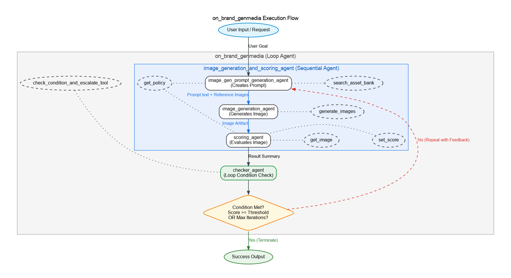

# On-Brand GenMedia Agent

This agent generates and evaluates images based on text descriptions while ensuring compliance with predefined policies. It functions as an automated image generation and validation system that maintains high standards of quality and policy compliance, iteratively improving images until they satisfy requirements. This repository uses a fictitious company, **NeuroVibe AI**, as an example to demonstrate brand guideline enforcement.

## Agent Details

| Feature | Description |
| --- | --- |
| **Interaction Type** | Workflow |
| **Complexity**  | Medium |
| **Agent Type**  | Multi Agent |
| **Components**  | Tools, Sub-Agents orchestration, Policy Validation Rules, Cloud Storage intermediates |
| **Vertical**  | Horizontal |

## Agent Architecture and Workflow

This diagram shows the detailed architecture of the agents and tools used to implement this workflow.

**Visual Key:** Rounded Boxes = **Agents** (Logic) | Dotted Ovals = **Tools** (Actions)



The Guidelines Driven Media Gen Agent implements a sequential workflow using specialized sub-agents:

1. **Prompt Generation Agent** (`image_gen_prompt_generation_agent`)
   * **Role**: Converts user intent into detailed prompts enriched with brand asset guidelines.
   * **Tools Used**: `get_policy`, `search_asset_bank`

2. **Image Generation Agent** (`image_gen_agent`)
   * **Role**: Generates high-quality images based on enriched prompts and saves them to Google Cloud Storage.
   * **Tools Used**: `generate_images`

3. **Scoring Agent** (`scoring_agent`)
   * **Role**: Evaluates safety, policy compliance, and layout parameters with detailed feedback scores.
   * **Tools Used**: `get_policy`, `get_image`, `set_score`

4. **Checker Agent** (`checker_agent`)
   * **Role**: Analyzes scores against quality thresholds to determine whether to iterate the generation or finalize it.
   * **Tools Used**: `check_condition_and_escalate_tool`

### Workflow Sequence
1. The **Prompt Generation Agent** creates an optimized prompt.
2. The **Image Generation Agent** uses this prompt to create an image.
3. The **Scoring Agent** evaluates the generated image against policy rules.
4. The **Checker Agent** determines if the score meets the threshold.
5. If the score is below threshold and max iterations not reached, the process repeats with self-correction feedback.
6. The workflow terminates when the image score meets the threshold or maximum iterations are reached.

## Setup and Installation

1.  **Prerequisites**

    *   Python 3.10+
    *   uv
        *   For dependency management and packaging. Please follow the instructions on the official [uv website](https://docs.astral.sh/uv/) for installation.

        ```bash
        curl -LsSf https://astral.sh/uv/install.sh | sh
        ```

    * A project on Google Cloud Platform
    * Google Cloud CLI
        *   For installation, please follow the instruction on the official [Google Cloud website](https://cloud.google.com/sdk/docs/install).

2.  **Installation**

    ```bash
    # Clone this repository.
    git clone https://github.com/google/adk-samples.git
    cd adk-samples/python/agents/on-brand-genmedia
    # Install the package and dependencies.
    uv sync --dev
    ```

3.  **Configuration**

    *   Set up Google Cloud credentials.

        *   There is a `.env-example` file included in the repository. Update this file with the values appropriate to your project, and save it as `.env`. The values in this file will be read into the environment of your application.

    *   Authenticate your GCloud account.

        ```bash
        gcloud auth application-default login
        gcloud auth application-default set-quota-project $GOOGLE_CLOUD_PROJECT
        ```

## Running the Agent


**Using `adk`**

ADK provides convenient ways to bring up agents locally and interact with them.
Here are some example requests you may ask the Guidelines Driven Media Gen Agent to process:

*   `Create an image of a NeuroVibe AI employee who is a female in early thirties wearing Cognitive white company T-shirt`

You may talk to the agent using the CLI:

```bash
adk run on_brand_genmedia
```

Or on a web interface:

```bash
adk web
```

The command `adk web` will start a web server on your machine and print the URL.
You may open the URL, select "on_brand_genmedia" in the top-left drop-down menu, and
a chatbot interface will appear on the right. The conversation is initially
blank. 

For a comprehensive user guide with example prompts, generated images, and customization instructions for digital assets and search logic, please refer to [User Guide and Customization](User_Guide_and_Customization.md). 
### Alternative: Using Agent Starter Pack

You can also use the [Agent Starter Pack](https://goo.gle/agent-starter-pack) to create a production-ready version of this agent with additional deployment options:

```bash
# Create and activate a virtual environment
python -m venv .venv && source .venv/bin/activate # On Windows: .venv\Scripts\activate

# Install the starter pack and create your project
pip install --upgrade agent-starter-pack
agent-starter-pack create my-on-brand-genmedia -a adk@on-brand-genmedia
```

<details>
<summary>⚡️ Alternative: Using uv</summary>

If you have [`uv`](https://github.com/astral-sh/uv) installed, you can create and set up your project with a single command:
```bash
uvx agent-starter-pack create my-on-brand-genmedia -a adk@on-brand-genmedia
```
This command handles creating the project without needing to pre-install the package into a virtual environment.

</details>

The starter pack will prompt you to select deployment options and provides additional production-ready features including automated CI/CD deployment scripts.

## Deployment on Vertex AI Agent Engine

You can deploy the Guidelines Driven Media Gen Agent directly to Google Cloud's Reasoning Engine (Agent Engine) using the provided deployment scripts.

1.  **Build the Agent Package:**
    Create a `.whl` file from the project root directory (where `pyproject.toml` is located):
    ```bash
    uv build --wheel --out-dir deployment
    ```

2.  **Configure Deployment Setup:**
    Open `deployment/deploy_config.json` and fill in your properties:
    ```json
    {
      "operation": "create",
      "project_id": "YOUR_GCP_PROJECT",
      "location": "us-central1",
      "bucket_name": "YOUR_STAGING_BUCKET"
    }
    ```

3.  **Initialize the deployment:**
    From the root directory, run the deployment script:
    ```bash
    uv run python deployment/deploy.py
    ```
    This script verifies the built wheel, creates staging buckets, deploys the agent securely to Agent Engine, and saves the resulting `AGENT_ENGINE_ID` into your `.env` file!

4.  **Test the deployment:**
    Chat with your deployed agent (reads from `.env` and `deploy_config.json`):
    ```bash
    uv run python deployment/test_deployment.py
    ```

5.  **Delete the deployment:**
    Set `"operation": "delete"` in your config file, or simply run:
    ```bash
    uv run python deployment/deploy.py delete
    ```

## Running Automated Evaluations

This section describes how to run automated evaluations on the **local agent logic** using datasets. It verifies agent behavior and tool usage before deployment (it does not call the live Endpoint on Vertex AI reasoning engine).

For running evaluation, install the extra dependencies:

```bash
uv sync --dev
```

Then the tests and evaluation can be run from the project root directory using the `pytest` module:

```bash
uv run pytest eval
```

The evaluation suite uses `AgentEvaluator` in ADK to run tests against the agent’s logic locally and checks if the tool usage and responses are as expected.


## Customization and Enterprise Extension

The Guidelines-Driven Media Generation Agent is built to be highly modular. You can customize the workflow, model choices, and retrieval mechanisms to fit your enterprise requirements without altering core logic.

### 🧩 Core Workflow Customizations

#### 1. Brand Policies & Guidelines
Modify the scoring rubrics and brand rules (e.g., in configuration files or databases) to change quality bars, brand safety rules, or layout constraints.

#### 2. Prompt Steering
Agent instructions (System Prompts) are abstracted into configuration files (e.g., `config.py`, `prompt.py`). You can customize these templates to change how agents interpret intent, generate descriptions, or apply self-correction feedback.

#### 3. Workflow Settings & Thresholds
Adjust system behavior and loop termination conditions via environment variables (`.env`) and `config.py`:
*   **Compliance Scoring Thresholds**: Define what cumulative score constitutes a "pass" or "fail".
*   **Loop Limits**: Set limits on maximum self-correction retry attempts (Max Iterations).

#### 4. Model Selection
Switch between different Gemini models (e.g., opting for Pro for planning, Flash for speed, or Nano Banana models for generation) by updating the model names in `config.py`.

---

### 🔍 Advanced Retrieval & RAG Extensions

The sample uses a classical **Lexical Retrieval (TF-IDF)** mechanism to find relevant brand assets in a local JSON file. This acts as a foundation for a production-grade **Retrieval-Augmented Generation (RAG)** pipeline.

#### 5. Dynamic Asset Search Methods
You can upgrade the retrieval tool to use more sophisticated search paradigms:
*   **Semantic Vector Search**: Integrate Vertex AI Embeddings and a Vector Database (AlloyDB, Vertex AI Vector Search) to match query *intent* rather than exact keywords.
*   **Multimodal Search (Visual Search)**: Use visual embeddings (Vertex AI Multimodal Embeddings) to search image libraries directly using text or visual queries.
*   **Hybrid Search**: Combine lexical (TF-IDF/BM25) and semantic search for maximum precision.

#### 6. Enterprise Storage & DAM Integration
While the sample reads from a local metadata store, the retrieval tool can be extended to connect directly with:
*   **Google Cloud Storage (GCS)**: List and fetch assets dynamically from cloud buckets.
*   **Digital Asset Management (DAM) Systems**: Query enterprise asset repositories via APIs.

#### 7. Similarity Logic & Score Tuning
Customize the cosine similarity scoring calculations or change how attributes are weighted (e.g., prioritizing color palette alignment over subject type) to tune the relevance of retrieved assets for your specific use cases. 


