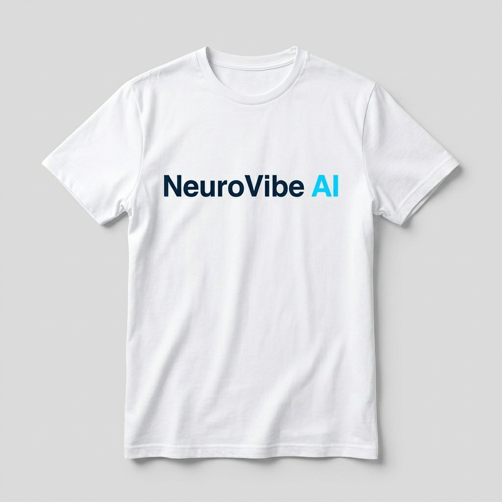
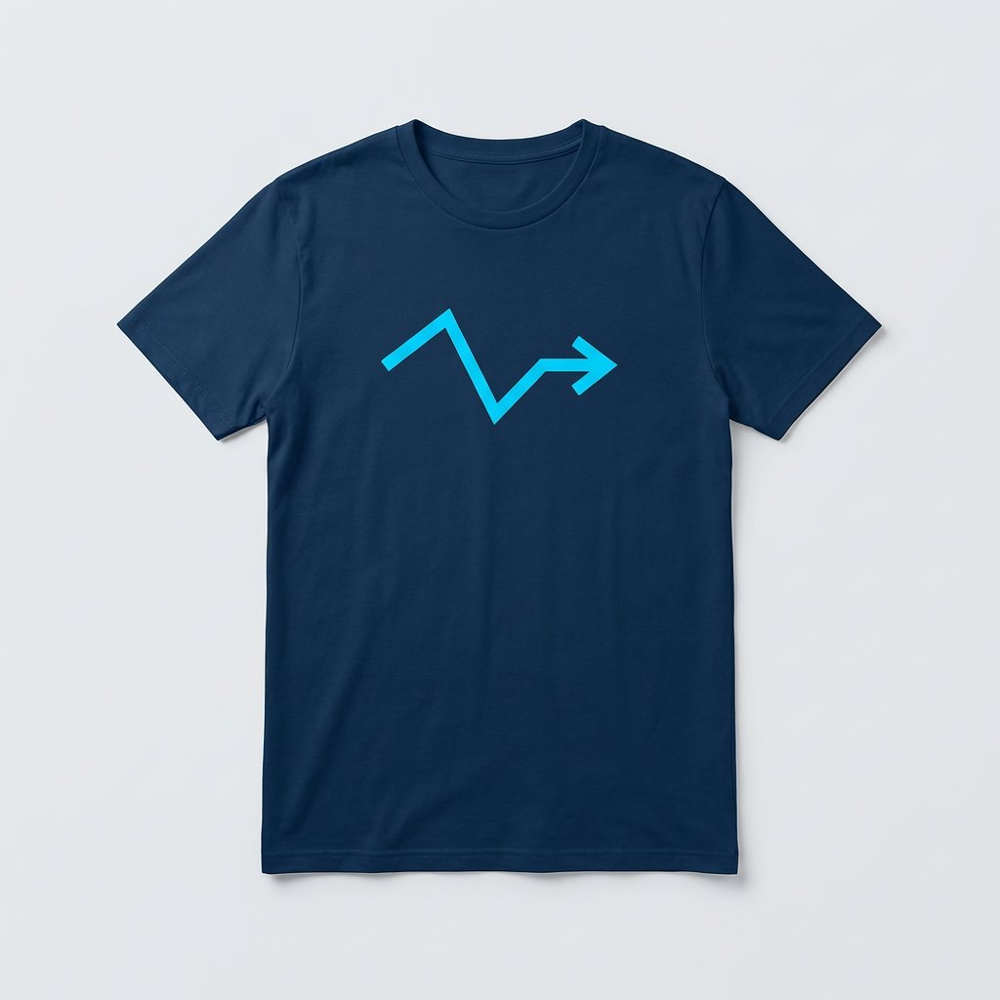
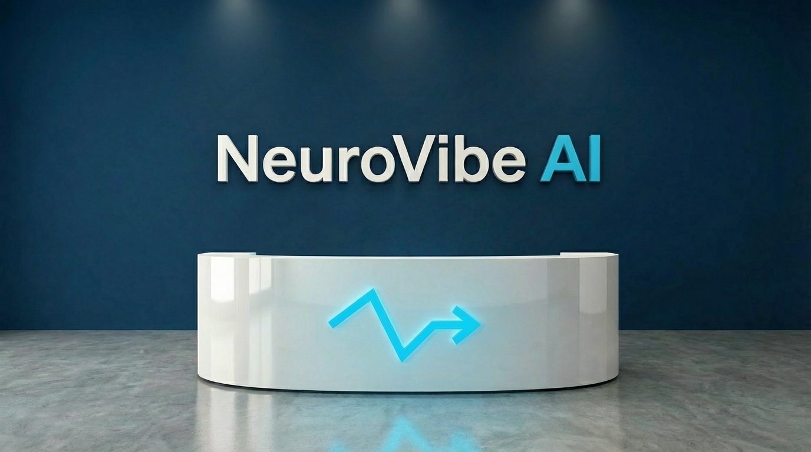
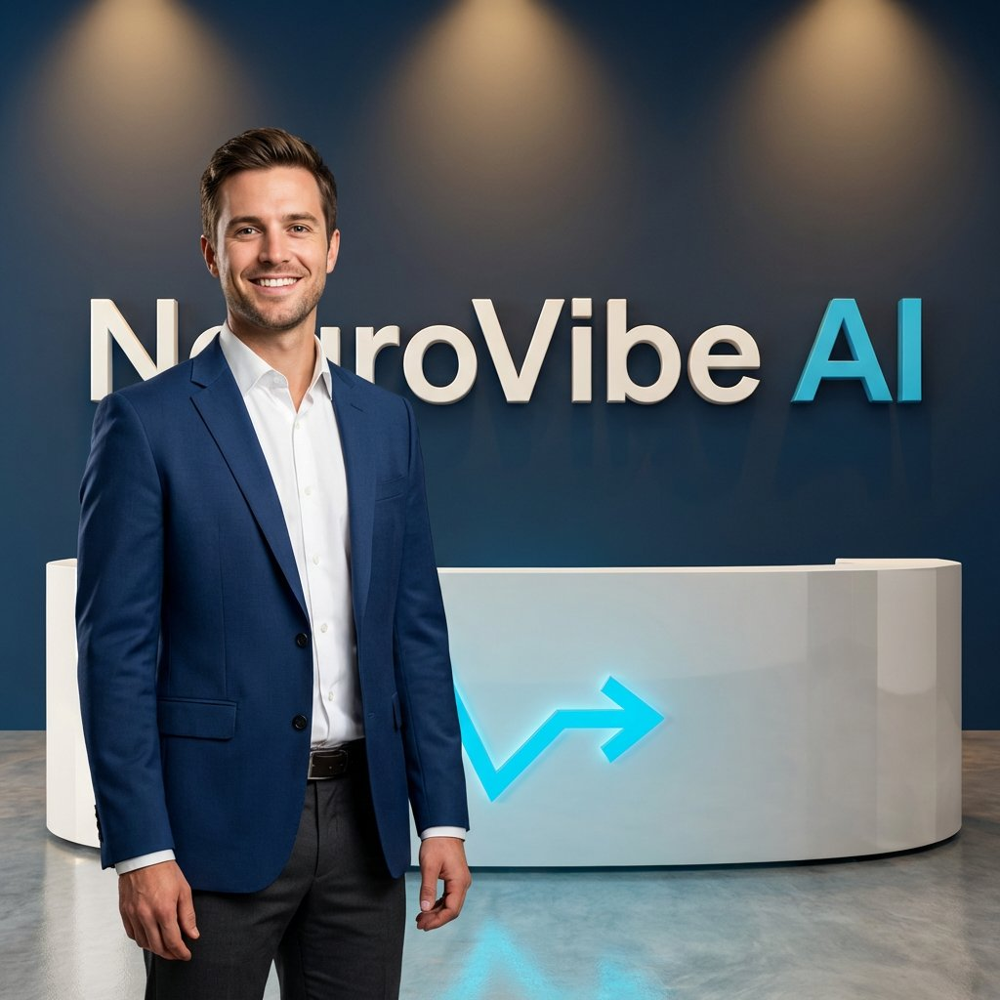
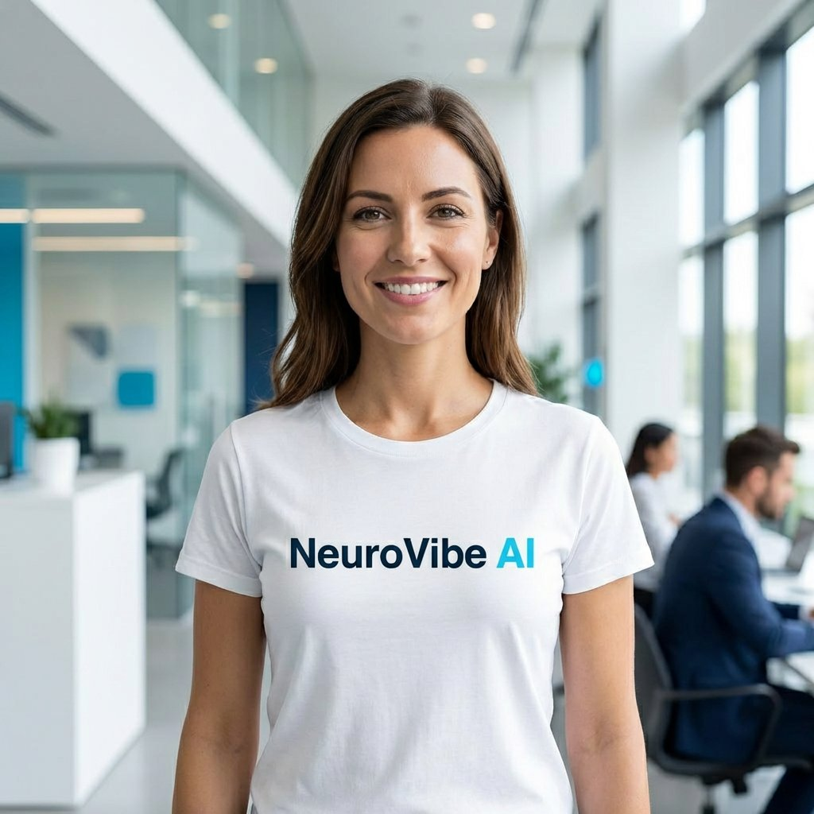

# User Guide and Customization

## Objective
This document demonstrates the On-Brand MediaGen Agent in action, showing how 1. users can use the agent and 2. how developers can customize it with their own digital assets and search logic.

## NeuroVibe AI Brand
The agent generates media that adheres to the fictitious **NeuroVibe AI** brand guidelines. Please refer to the [NeuroVibe AI Brand Guidelines](on_brand_genmedia/data/NeuroVibe_AI_Brand_Guidelines.pdf) for detailed information on brand colors, logos, and style.

## Available Digital Assets
The agent can utilize existing digital assets to maintain brand consistency. 

Folder link: [Digital Assets Directory](on_brand_genmedia/data/assets/)

Below are the available digital assets:

| Cognitive White T-Shirt | NeuroBlue T-Shirt | NeuroVibe AI Office Reception |
| :---: | :---: | :---: |
|  |  |  |

## Examples of Usage
Here are examples of prompts and the corresponding generated images.

### Example 1
**Prompt:** "Generate an medium shot image of a professional dressed young male in thirties standing in the NeuroVibe AI office reception area"



---

### Example 2
**Prompt:** "Create an image of a NeuroVibe AI employee who is a female in early thirties wearing Cognitive white company T-shirt"



---


## Customization

This section explains how to customize the agent for your own brand by updating digital assets or modifying the search logic.

### How to Update Digital Assets

The agent uses stored images and a metadata JSON file to reference existing digital assets.

1.  **Add Images**: Place new image files in the `on_brand_genmedia/data/assets/` directory.
2.  **Update Metadata**: Open `on_brand_genmedia/data/brand_assets_metadata.json` and add an entry for the new asset. Below is a suggested exmaple based on the existing file. Please feel free to come up with your own schema and fields based on your needs.

Example JSON entry:
```json
  {
    "id": 5,
    "primary_subject_type": "mug",
    "primary_subject_color_name": "Neuro Blue",
    "primary_subject_color_hex_code": "#0A2540",
    "name": "NeuroVibe Coffee Mug",
    "has_person": "no",
    "category": "merchandise",
    "allow_modifications": "no",
    "description": "A ceramic coffee mug with the NeuroVibe AI logo.",
    "image_path": "assets/NeuroVibe_Coffee_Mug.png"
  }
```

### How Search Logic Works & How to Update It

When a user prompt implies using an existing asset, the agent searches the asset bank using text similarity.

*   **Location**: The search logic is implemented in `on_brand_genmedia/sub_agents/prompt/tools/fetch_existing_assets.py`.
*   **Mechanism**: It uses **TF-IDF (Term Frequency-Inverse Document Frequency)** and **Cosine Similarity** (via `scikit-learn`) to compare the user's query against the descriptions in the metadata JSON.
*   **How to Update**:
    *   **Fine-tuning**: You can modify the `preprocess` function to clean text differently or add more weight to certain fields (e.g., matching colors).
    *   **Advanced search**: For larger asset banks, you can replace the TF-IDF logic with a vector database (e.g., ChromaDB with embeddings) or use an external service like Vertex AI Search.
