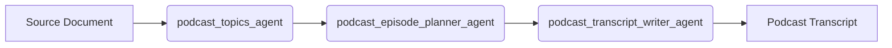

# Podcast Transcript Agent

## Overview

The Podcast Transcript Agent transforms a source document into a complete, conversational podcast transcript.
It uses a sequential multi-agent pipeline to extract topics, build an episode plan, and generate final dialogue.

This sample is compatible with the Agent Starter Pack (ASP) and can be used as a base for production-ready deployments.

## Agent Details

The key features of the Podcast Transcript Agent include:

| Feature | Description |
| --- | --- |
| Interaction Type | Conversational |
| Complexity | Medium |
| Agent Type | Multi Agent |
| Components | SequentialAgent, Structured Output |
| Vertical | Media and Content |

### Agent Architecture



### Key Features

- Automated content repurposing from text and document inputs.
- Structured episode planning before final transcript generation.
- Conversational script output with customizable host and expert personas.
- Extensible sequential design for adding new processing stages.

## Using Agent Starter Pack (ASP)

Use the Agent Starter Pack to scaffold a production-ready version of this agent with additional deployment and configuration options.

Create and activate a virtual environment:

```bash
python -m venv .venv
# Linux/macOS
source .venv/bin/activate
# Windows
.venv\Scripts\activate
```

Create a starter project with uv:

```bash
uvx agent-starter-pack create my-podcast-transcript -a adk@podcast-transcript-agent
```

## Setup and Installation

1. Prerequisites

- Python 3.13+
- uv for dependency management
- Google Cloud project with Vertex AI enabled

2. Installation

```bash
git clone https://github.com/google/adk-samples.git
cd adk-samples/python/agents/podcast_transcript_agent
uv sync --dev
```

3. Configuration

Create a `.env` file in the agent root and set:

```env
GOOGLE_CLOUD_PROJECT="your-gcp-project-id"
GOOGLE_CLOUD_LOCATION="us-central1"
GOOGLE_GENAI_USE_VERTEXAI=True
```

Authenticate application default credentials:

```bash
gcloud auth application-default login
```

## Running the Agent

Run in CLI mode:

```bash
uv run adk run podcast_transcript_agent
```

Run in the ADK web UI:

```bash
uv run adk web
```

## Example Interaction

```text
User: Generate a podcast transcript from the attached document. Host is Charlotte and expert is Dr Joe Sponge.
Agent: I will extract the key topics, build an episode plan, and generate a complete transcript.
```

## Running Tests

Run tests:

```bash
uv run pytest -s -W default
```

Run linting and formatting:

```bash
uv run ruff check . --fix
uv run ruff format .
```

Run static typing:

```bash
uv run mypy .
```

## Disclaimer

This sample is provided for illustrative purposes and is not intended for direct production use.
Before production deployment, add environment-specific hardening for reliability, observability, security, and scale.
