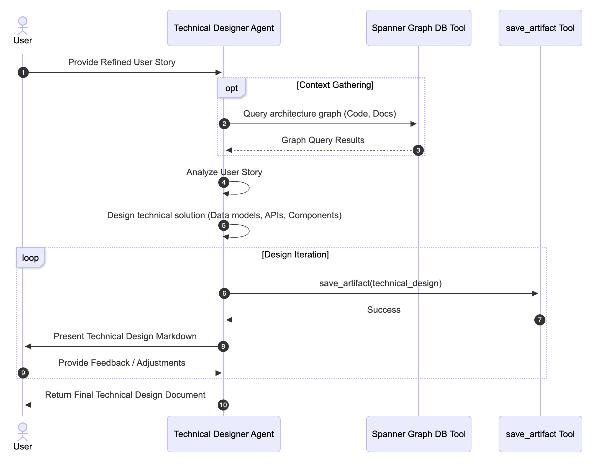
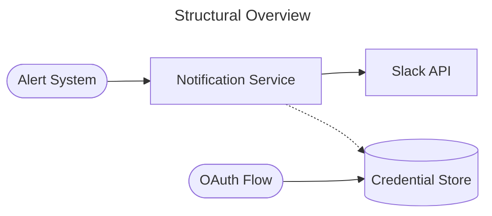

# Technical Designer

## A. Overview & Functionalities

This agent is intended to be used as part of a broader Software Development Life Cycle (SDLC) workflow. For more details on how it integrates with other agents, please see the [SDLC Agents Workflow](sdlc_agents_workflow.md):


### Agent Details Table
| Interaction Type | Conversational / Workflow |
| :--- | :--- |
| **Complexity** | Easy |
| **Agent Type** | Single Agent |
| **Vertical** | Software Architecture / Engineering |
| **Key Features** | Architectural analysis, Spanner Code Knowledge Graph exploration, interactive technical clarification, Architecture Decision Record (ADR) creation, Mermaid architecture diagram generation, outputs standardized RFC Technical Design Markdown.

## B. Architecture



### Example Interaction
**User:** Here is the refined user story for the Slack notification integration:
# [STORY TITLE: Slack Integration for Critical System Alerts]
[...]
Please propose a technical design for implementing this.

**Agent:** I've queried the Code Knowledge Graph and analyzed the current notification architecture. Here is the technical design for the Slack integration:

# RFC: Slack Integration for Critical System Alerts

## 1. Context and Scope
* **Background:** The DevOps team needs immediate visibility into critical system alerts via Slack. This requires a workspace-level OAuth flow and a mechanism to post formatted messages.
* **Goals:** Implement Slack OAuth, store workspace tokens securely, and extend the existing `NotificationService` to support Slack as a destination.
[...]

## 2. Proposed Architecture

[...]

## C. Setup & Execution

### Prerequisites & Installation

*   Python 3.10+
*   uv
    *   For dependency management and packaging. Please follow the instructions on the official [uv website](https://docs.astral.sh/uv/) for installation.

    ```bash
    curl -LsSf https://astral.sh/uv/install.sh | sh
    ```

Set up your environment variables by copying the example file:
```bash
cp .env.example .env
```
Populate `.env` with your GCP project and Spanner details. If left null, the agent will operate without external database queries.

Install dependencies:
```bash
uv sync --dev
```

### Running the Agent
Run the agent locally via CLI:
```bash
uv run adk web sdlc_technical_designer
```

### Alternative: Using Agent Starter Pack

You can also use the [Agent Starter Pack](https://goo.gle/agent-starter-pack) to create a production-ready version of this agent with additional deployment options:

```bash
# Create and activate a virtual environment
python -m venv .venv && source .venv/bin/activate # On Windows: .venv\Scripts\activate

# Install the starter pack and create your project
pip install --upgrade agent-starter-pack
agent-starter-pack create my-technical-designer -a adk@sdlc-technical-designer
```

<details>
<summary>⚡️ Alternative: Using uv</summary>

If you have [`uv`](https://github.com/astral-sh/uv) installed, you can create and set up your project with a single command:
```bash
uvx agent-starter-pack create my-technical-designer -a adk@technical-designer
```
This command handles creating the project without needing to pre-install the package into a virtual environment.

</details>

The starter pack will prompt you to select deployment options and provides additional production-ready features including automated CI/CD deployment scripts.

## D. Customization & Extension

- **Modifying the Flow:** Adjust the RFC document structure, diagram types, or required architecture checks in `sdlc_technical_designer/prompt.py`.
- **Adding Tools:** Introduce external integrations like cloud resource estimators or architecture linters in `sdlc_technical_designer/tools/`.
- **Changing Data Sources:** Configure Spanner queries to point to different codebase graph instances or knowledge bases.
