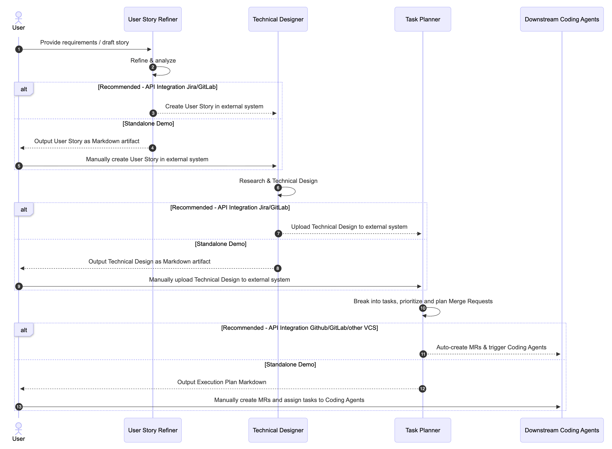
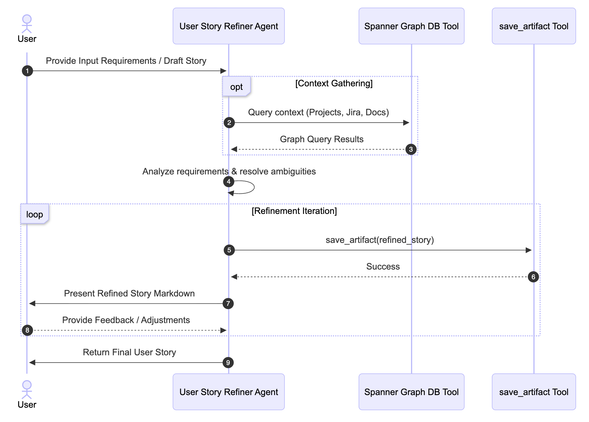

# User Story Refiner

## A. Overview & Functionalities

This agent is intended to be used as part of a broader Software Development Life Cycle (SDLC) workflow. For more details on how it integrates with other agents, please see the [SDLC Agents Workflow](sdlc_agents_workflow.md):



### Agent Details Table
| Interaction Type | Conversational |
| :--- | :--- |
| **Complexity** | Easy |
| **Agent Type** | Single Agent |
| **Vertical** | Software Engineering / Product Management |
| **Key Features** | Requirement analysis, interactive clarification via structured questions, context retrieval using Spanner, BDD-style Acceptance Criteria generation, outputs standardized Markdown User Stories.

## B. Architecture



### Example Interaction
**User:** I want to build a Slack integration for our notification system. When a critical system alert triggers in our app, it should automatically post a formatted message to a specific Slack channel. We'll need to handle OAuth for Slack workspaces.

**Agent:** To create a standardized user story, I need a few more details.
1. Which Persona is this primarily for? (e.g., 1. System Administrator, 2. DevOps Engineer, 3. Regular User)
2. For the OAuth flow, do we need to store the Slack credentials globally for the workspace or per-user?

**User:** 1. DevOps Engineer. 2. Globally for the workspace.

**Agent:** Great. I have refined this into the following user story:

# [STORY TITLE: Slack Integration for Critical System Alerts]

**Issue Type:** User Story
**Status:** Ready for Development
**Priority:** High

## 1. Description
**As a** DevOps Engineer,
**I want to** integrate our notification system with Slack using OAuth,
**So that** critical system alerts are automatically posted to a designated Slack channel, allowing for rapid incident response.

[...]

## C. Setup & Execution

### Prerequisites & Installation

*   Python 3.10+
*   uv
    *   For dependency management and packaging. Please follow the instructions on the official [uv website](https://docs.astral.sh/uv/) for installation.

    ```bash
    curl -LsSf https://astral.sh/uv/install.sh | sh
    ```

Set up your environment variables by copying the example file:
```bash
cp .env.example .env
```
Populate `.env` with your project details. The agent will run gracefully even if database settings are left null, but then the agent will ask for more context from the user.

Install dependencies:
```bash
uv sync --dev
```

### Running the Agent
Run the agent locally:
```bash
uv run adk web sdlc_user_story_refiner
```

### Alternative: Using Agent Starter Pack

You can also use the [Agent Starter Pack](https://goo.gle/agent-starter-pack) to create a production-ready version of this agent with additional deployment options:

```bash
# Create and activate a virtual environment
python -m venv .venv && source .venv/bin/activate # On Windows: .venv\Scripts\activate

# Install the starter pack and create your project
pip install --upgrade agent-starter-pack
agent-starter-pack create my-user-story-refiner -a adk@sdlc-user-story-refiner
```

<details>
<summary>⚡️ Alternative: Using uv</summary>

If you have [`uv`](https://github.com/astral-sh/uv) installed, you can create and set up your project with a single command:
```bash
uvx agent-starter-pack create my-user-story-refiner -a adk@user-story-refiner
```
This command handles creating the project without needing to pre-install the package into a virtual environment.

</details>

The starter pack will prompt you to select deployment options and provides additional production-ready features including automated CI/CD deployment scripts.

## D. Customization & Extension

- **Modifying the Flow:** Adjust the core refinement rules, required Story formatting, or interactive question styles in `sdlc_user_story_refiner/prompt.py`.
- **Adding Tools:** Integrate external ticket tracking APIs (e.g., Jira, Linear, GitLab) in `sdlc_user_story_refiner/tools/`.
- **Changing Data Sources:** Swap out Spanner for Vector databases or Confluence APIs to retrieve historical context.
