# Story Teller Agent

## Overview

The Story Teller Agent is a multi-agent system designed for collaborative story writing. This is a simple, yet powerful, multi-agent ADK sample that takes a user prompt and transforms it into a complete, multi-chapter story. The agent leverages a team of specialized AI agents, each with a unique role, to brainstorm, draft, critique, and edit the story, showcasing a sophisticated workflow for creative content generation.

## Agent Architecture

This agent uses a sequential workflow that orchestrates several sub-agents to produce a story. The process is as follows:

1.  **Prompt Enhancer**: Takes a basic user idea and expands it into a detailed premise, setting the stage for the story.
2.  **Story Loop**: This is the core of the writing process, which iterates for a predefined number of chapters.
    *   **Parallel Writers**: Within the loop, two writer agents, a `Creative Writer` and a `Focused Writer`, simultaneously create two different versions of the next chapter. The `Creative Writer` uses a high temperature for more imaginative and unpredictable results, while the `Focused Writer` uses a low temperature for more logical and consistent writing.
    *   **Critique Agent**: This agent reviews the two chapter drafts and selects the one that best fits the story's premise and narrative arc.
3.  **Editor Agent**: Once all chapters are written, the `Editor Agent` performs a final review of the entire story, polishing it for grammar, flow, and consistency.

This diagram illustrates the agent's architecture:



## Agent Details

| Feature | Description |
| --- | --- |
| **Interaction Type** | Pipeline |
| **Complexity** | Medium |
| **Agent Type** | Sequential Agent (with Parallel and Loop sub-agents) |
| **Components** | `LlmAgent`, `SequentialAgent`, `ParallelAgent`, `LoopAgent` |
| **Tools** | Simple State Management |
| **Vertical** | Creative & Content Generation |

-   **Core Logic:** The agent's main logic is defined in `story-teller/story-teller-agent/agent.py`.
-   **Instructions:** The prompts for each agent are located in `story-teller/story-teller-agent/instructions.py`.

## Setup and Installation

1.  **Prerequisites**

    *   Python 3.11+
    *   [Poetry](https://python-poetry.org/docs/) for dependency management.

2.  **Installation**

    ```bash
    # Navigate to the agent's directory
    cd adk-samples/python/agents/story-teller
    # Install the package and dependencies.
    poetry install
    ```

3.  **Configuration**

    Set up the `GOOGLE_API_KEY` environment variable.

## Running the Agent Locally

You can run the agent locally using the `adk` command in your terminal.

1.  **To run the agent from the CLI:**

    ```bash
    adk run .
    ```

2.  **To run the agent from the ADK web UI:**

    ```bash
    adk web
    ```

    Then select `story-teller-agent` from the dropdown menu.

## Example Interaction

When you run the agent, it will use the default prompt in `agent.py` to generate a story. Here is an example of the output:

**User:**
```
A sci-fi mystery about a detective who is investigating a murder on a space station.
```