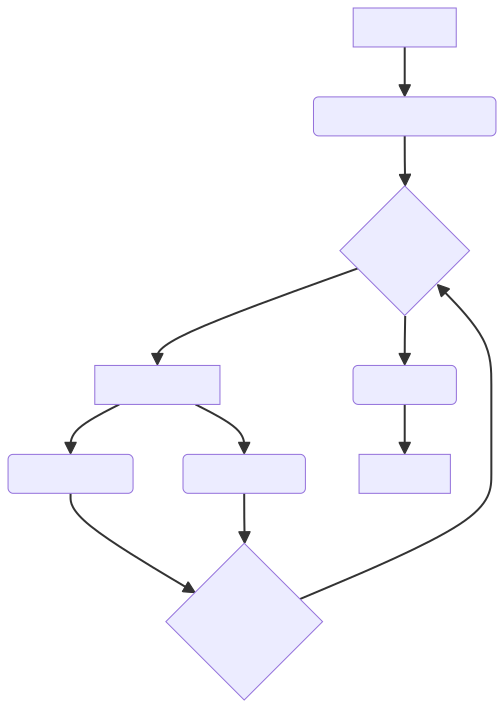

# Story Teller Agent

## Overview

The Story Teller Agent is a multi-agent system designed for collaborative story writing. This is a simple, yet powerful, multi-agent ADK sample that takes a user prompt and transforms it into a complete, multi-chapter story. The agent leverages a team of specialized AI agents, each with a unique role, to brainstorm, draft, critique, and edit the story, showcasing a sophisticated workflow for creative content generation.

## Agent Architecture

This agent uses a sequential workflow that orchestrates several sub-agents to produce a story. The process is as follows:

1.  **Prompt Enhancer**: Takes a basic user idea and expands it into a detailed premise, setting the stage for the story.
2.  **Story Loop**: This is the core of the writing process, which iterates for a predefined number of chapters.
    *   **Parallel Writers**: Within the loop, two writer agents, a `Creative Writer` and a `Focused Writer`, simultaneously create two different versions of the next chapter. The `Creative Writer` uses a high temperature for more imaginative and unpredictable results, while the `Focused Writer` uses a low temperature for more logical and consistent writing.
    *   **Critique Agent**: This agent reviews the two chapter drafts and selects the one that best fits the story's premise and narrative arc.
3.  **Editor Agent**: Once all chapters are written, the `Editor Agent` performs a final review of the entire story, polishing it for grammar, flow, and consistency.

This diagram illustrates the agent's architecture:



## Agent Details

| Feature | Description |
| --- | --- |
| **Interaction Type** | Pipeline |
| **Complexity** | Medium |
| **Agent Type** | Sequential Agent (with Parallel and Loop sub-agents) |
| **Components** | `LlmAgent`, `SequentialAgent`, `ParallelAgent`, `LoopAgent` |
| **Tools** | Simple State Management |
| **Vertical** | Creative & Content Generation |

-   **Core Logic:** The agent's main logic is defined in `story-teller/story-teller-agent/agent.py`.
-   **Instructions:** The prompts for each agent are located in `story-teller/story-teller-agent/instructions.py`.

## Setup and Installation

### Prerequisites

- Python 3.11+
- uv for dependency management and packaging
  - See the official [uv website](https://docs.astral.sh/uv/) for installation.

  ```bash
  curl -LsSf https://astral.sh/uv/install.sh | sh
  ```

## Agent Starter Pack (recommended)

Use the [Agent Starter Pack](https://goo.gle/agent-starter-pack) to scaffold a production-ready project and choose your deployment target ([Vertex AI Agent Engine](https://cloud.google.com/vertex-ai/generative-ai/docs/agent-engine/overview) or [Cloud Run](https://cloud.google.com/run)), with CI/CD and other production features. The easiest way is with [uv](https://docs.astral.sh/uv/) (one command, no venv or pip install needed):

```bash
uvx agent-starter-pack create my-story-teller -a adk@story-teller-agent
```

If you don't have uv yet: `curl -LsSf https://astral.sh/uv/install.sh | sh`

The starter pack will prompt you to select deployment options and set up your Google Cloud project.

<details>
<summary>Alternative: Using pip and a virtual environment</summary>

```bash
# Create and activate a virtual environment
python -m venv .venv && source .venv/bin/activate # On Windows: .venv\Scripts\activate

# Install the starter pack and create your project
pip install --upgrade agent-starter-pack
agent-starter-pack create my-story-teller -a adk@story-teller-agent
```

</details>

From your newly created project directory (e.g. `my-story-teller`), run:

```bash
cd my-story-teller
uv sync --dev
uv run adk run story_teller_agent
```

For the web UI:

```bash
uv run adk web
```

Then select `story-teller-agent` from the dropdown menu.

---

<details>
<summary>Alternative: Local development (run from this sample repo)</summary>

### Agent Setup

1. Clone the repository:

   ```bash
   git clone https://github.com/google/adk-samples.git
   cd adk-samples/python/agents/story_teller
   ```

   For the rest of this tutorial **ensure you remain in the `python/agents/story_teller` directory**.

2. Install the dependencies:

   ```bash
   uv sync
   ```

3. Configure settings:

   Set the `GOOGLE_API_KEY` environment variable (or use Application Default Credentials with Vertex AI). You can use a `.env` file or export in your shell, for example:

   ```bash
   export GOOGLE_CLOUD_PROJECT=my-project
   export GOOGLE_CLOUD_LOCATION=my-region
   # Optional: for Vertex AI
   export GOOGLE_GENAI_USE_VERTEXAI=1
   ```

### Running the Agent Locally

You can run the agent locally using the `adk` command in your terminal:

1. To run the agent from the CLI:

   ```bash
   adk run .
   ```

2. To run the agent from the ADK web UI:

   ```bash
   adk web
   ```
   Then select `story-teller-agent` from the dropdown.

### Development

```bash
uv sync --dev
uv run pytest
```

</details>

## Example Interaction

When you run the agent, it will use the default prompt in `agent.py` to generate a story. Here is an example of the output:

**User:**
```
A sci-fi mystery about a detective who is investigating a murder on a space station.
```