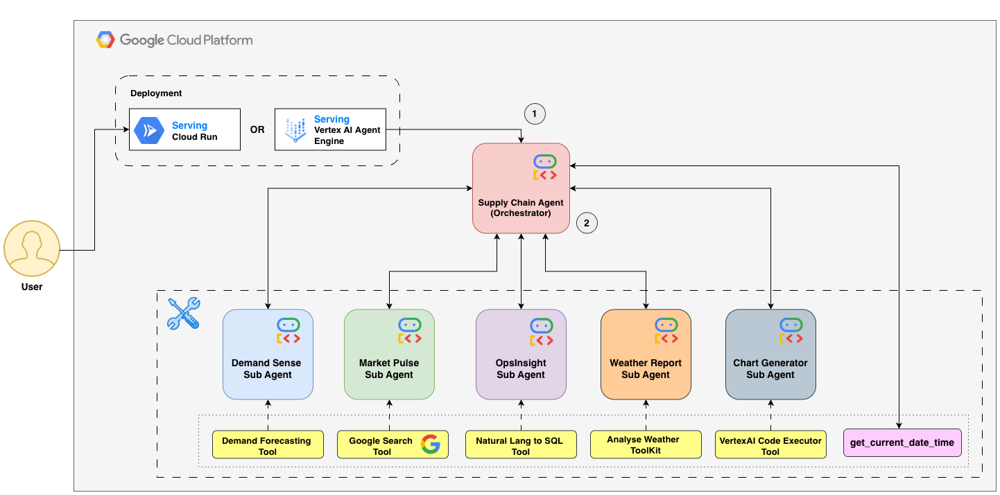

# Supply Chain Agent

## Overview

This agent sample implements a system of autonomous AI agents designed using Google ADK framework to analyse real-time market dynamics, weather conditions, internal consumption & generation capacities and demand forecasts. These agents then forward their individual outputs which is cumulatively factored in to suggest optimisations for the current supply chain (e.g. resource procurement if demand is going to peak).

**Domain**: `Power and Energy`

Key System Capabilities:

- **Analyze Real-Time External Events**: Continuously scans and interprets public news, weather forecasts, and commodity prices to identify external risks and opportunities.
- **Monitor Internal Operations**: Accesses and analyzes private, internal data (e.g., generation capacity, supplier yields, inventory) using natural language.
- **Predictive Demand Forecasts**: Leverages historical data to accurately predict future energy demand.
- **Provide Holistic Optimization**: Synthesizes insights from all data streams (internal, external, and predictive) to recommend concrete, actionable supply chain strategies.
- **Deliver Dynamic Visualizations**: Automatically generates charts to make complex data and forecasts easy to understand.

## Agent Details

The key features of the Supply Chain Agent include:

| Feature               | Description                   |
| --------------------- | ----------------------------- |
| **Interaction Type:** | Conversational                |
| **Complexity:**       | Intermediate                  |
| **Agent Type:**       | Multi Agent                   |
| **Components:**       | Tools, AgentTools             |
| **Vertical:**         | Power & Energy (Supply Chain) |

## Architecture



The above architecture outlines an intelligent, mulit-agent-based workflow for processing a user's query for supply chain optimization.

The Supply Chain Agent then **delegates tasks to multiple specialized sub-agents** that function as a coordinated team, with each agent handling a specialized role to analyze, predict, and optimize the supply chain.

- 🧠 Supply Chain Agent (The Orchestrator): Receives user queries, coordinates all sub-agents, and synthesizes their findings into a final, actionable recommendation.

- 🌐 MarketPulse Agent (The Sentinel): Scans the external world for risks for real-time information using **Google Search Tool**.

- 🏭 OpsInsight Agent (The Producer): Monitors internal capacity, inventory, and production data by querying internal BigQuery database using **Natural Language-to-SQL Tool**.

- 📈 DemandSense Agent (The Forecaster): Analyses historical data and market signals to predict future customer demand with a **Forecasting Tool**.

- 🌤️Weather Reporting Agent (The Weather Analyst): Analyses weather pattern (based on WeatherNext forecast data) to detect potential logistic disruptions, transportation, and route risks using **Weather Toolkit**.

- 📊 Chart Generator Agent (The Visualizer): Creates dynamic charts from the analyzed data using a **VertexAI Code Executor Tool** to aid in decision-making.

Along with these specialized sub agents, agent also uses **Get Current Date & Time as a Function Tool** to check the current date & time for specific timezone

## Setup and Installations

### Prerequisites

- **Python 3.11+**: Ensure you have Python 3.11 or a later version installed.
- **uv (for dependency management)**: Install uv by following the instructions on the official uv website: https://docs.astral.sh/uv/getting-started/installation/
- **A Project on Google Cloud Platform**: For Vertex AI Gemini integration and BigQuery
- **Google Cloud CLI**: For installation, please follow the instruction on the official [Google Cloud website](https://cloud.google.com/sdk/docs/install).
- **Google Geocoding API Key**: For getting location based on lat/long - (Optional)
- **Git**: Ensure you have git installed. If not, you can download it from https://git-scm.com/ and follow the [installation guide](https://git-scm.com/book/en/v2/Getting-Started-Installing-Git)

### Installation

1.  Clone the repository

    ```bash
    git clone https://github.com/google/adk-samples.git
    cd adk-samples/python/agents/supply-chain
    ```

2.  Install dependencies

    ```bash
    # Verify if uv is installed correctly
    uv --version

    # Sync dependencies.
    uv sync
    ```

3.  Set up Google Cloud credentials
    - Ensure you have a Google Cloud project.
    - Make sure you have the Vertex AI API enabled in your project.
    - Set the `GOOGLE_GENAI_USE_VERTEXAI`, `GOOGLE_CLOUD_PROJECT`, and `GOOGLE_CLOUD_LOCATION` environment variables. You can set them in your `.env` file (modify and rename .env.example file to .env) or directly in your shell.

    ```bash
    export GOOGLE_GENAI_USE_VERTEXAI=1

    export GOOGLE_CLOUD_PROJECT=<your-project-id>
    export GOOGLE_CLOUD_LOCATION=<your-project-location>
    export GOOGLE_CLOUD_STORAGE_BUCKET=<your-storage-bucket-for-deployment-artifacts>
    ```

4.  Authenticate your Google Cloud account.

    ```bash
     gcloud auth application-default login
     gcloud auth application-default set-quota-project $GOOGLE_CLOUD_PROJECT
    ```

## Dataset used

We have provided a sample power generation & consumption data in `dataset` folder which needs to be added to the BigQuery.
The CSV file `state_power_supply_data.csv` contains the following columns:

[`date`, `state`, `latitude`, `longitude`, `state_area_km2`, `region`, `national_share_percentage`, `consumption_mega_units`, `thermal_actual_mega_units`, `thermal_estimated_mega_units`, `nuclear_actual_mega_units`, `nuclear_estimated_mega_units`, `hydro_actual_mega_units`, `hydro_estimated_mega_units`, `total_generation_actual_mega_units`, `total_generation_estimated_mega_units`, `power_supplier`]

1. Upload the data to BigQuery

### Set your google cloud project and location

```bash
export GOOGLE_CLOUD_PROJECT=<your-project-id>
export GOOGLE_CLOUD_LOCATION=<your-project-location>
```

### Create a BigQuery dataset

```bash
bq mk --location=$GOOGLE_CLOUD_LOCATION --dataset $GOOGLE_CLOUD_PROJECT:supply_chain
```

### Create a table and upload data

```bash
bq load --location=$GOOGLE_CLOUD_LOCATION --source_format=CSV --autodetect --skip_leading_rows=1 $GOOGLE_CLOUD_PROJECT:supply_chain.state_power_supply ./dataset/state_power_supply_data.csv
```

### Create a optimized table

Run the following SQL query in BigQuery Studio

```bash
CREATE OR REPLACE TABLE `$GOOGLE_CLOUD_PROJECT.supply_chain.state_power_supply_optimized`
PARTITION BY date
CLUSTER BY state, region, power_supplier
OPTIONS(
  partition_expiration_days=NULL,
  require_partition_filter=FALSE
)
AS
SELECT * FROM `$GOOGLE_CLOUD_PROJECT.supply_chain.state_power_supply`;
```

2. Update the BQ dataset id and table id in `.env` file

```bash
  export BIGQUERY_DATASET_ID=<your_bq_dataset_id>
  export BIGQUERY_TABLE_ID=<your_bq_table_id>
```

## Running the Agent

You can run the agent using the ADK commant in your terminal.
from the root project directory:

0. Activate the virtual env

   ```bash
   source .venv/bin/activate
   ```

1. Run agent in CLI:

   ```bash
   uv run adk run supply_chain
   ```

2. Run agent with ADK Web UI:
   ```bash
   uv run adk web
   ```
   Select the supply_chain from the dropdown

### Example Interaction

Below is an example interaction with the Supply Chain Agent.

> **User:** Hi there

> **Agent:** Hello, I am your AI powered Power & Energy Supply Chain Management Analyst. My purpose is to provide data and insights specifically related to power generation, consumption, and supply, so I am unable to assist with topics outside of this domain.

> **User:** What capabilities do you have?

> **Agent:** I can provide data and insights related to power generation, consumption, and supply chain management. This includes:
>
>      * Forecasting power consumption.
>      * Providing current details on power consumption and generation.
>      * Gathering real-time market pulse information.
>      * Analyzing weather data that may impact the supply chain.
>      * Generating visualizations to help understand the data.
>
> I can also provide the current date and time.

> **User:** Forecast demand for the next 3 days in state of Delhi

> **Agent:** The demand forecast for Delhi for the next three days is as follows:
>
>      * December 6, 2025: 81.11 MWh
>      * December 7, 2025: 85.12 MWh
>      * December 8, 2025: 85.01 MWh
>
> The forecast indicates a slight increase in consumption from December 6th to December 7th, followed by a stabilization on December 8th. This projection is based on historical data and utilizes the Triple Exponential Smoothing method.

> **User:** What are the real time trends of power consumption in Delhi?

> **Agent:** The real time trends in power consumption in Delhi show a significant upward trajectory, with an observed increase of nearly 37% from 2011-12 to 2022-23. This rise is attributed to factors such as urbanization, high population density, and an expanding consumer base.
>
> Key trends include:
>
>       * Increased Peak Demand: Peak power demand has risen substantially, with projections indicating a potential 50% increase over the current decade.
>       * Seasonal Variations: High demand is consistently observed during the summer and winter months, which are characteristic of the region's climate.
>       * Energy Mix: While Delhi is actively integrating more renewable energy sources, fossil fuels continue to play a substantial role in its energy mix.
>
> Efforts are underway to upgrade the city's power infrastructure and implement strategies to effectively manage peak demand.

> **User:** Tell me the state with max power generation?

> **Agent:** The state with the maximum power generation is Maharashtra, with a total generation of 1,374,653.83 mega units.

> **User:** What is the weather like in Delhi on 2025-01-13?

> **Agent:** The weather in Delhi on January 13th, 2025, is expected to have a temperature range with highs around 19°C and lows around 9.5°C. There is no precipitation expected, indicating dry conditions. `[IMAGES: Weather Charts]`

> **User:** Based on above demand, internal and external factors including risk from weather tell me the impact on supply chain?

> **Agent:** Executive Summary: The power supply chain in Delhi is influenced by a steady increase in demand, as indicated by recent forecasts and long-term consumption trends.
>
> Critical Insights:
>
>      * Rising Demand Trajectory: The forecasted demand for Delhi for the next three days (peaking at 85.12 MWh on   December 7th) aligns with the observed upward trend in power consumption. This sustained increase necessitates a robust and consistently available power supply....
>
> Actionable Recommendations:
>
>      * Enhance Demand-Supply Balancing Mechanisms: Continuously monitor short-term demand forecasts and long-term consumption trends to ensure adequate generation and transmission capacity is available, particularly to meet projected peak loads....

> **User:** Thank you

> **Agent:** You're welcome! If you have any other questions or need further assistance, feel free to ask.

## Testing and Evaluation

To run the test and evaluation, you need a few additional dependencies. Run
the following uv command from the `agents/supply-chain` directory to install them:

```bash
uv sync
```

1. Running Tests

Tests assess the overall executability of the agents.
The tests can be run from the `agents/supply-chain` directory using
the `pytest` module.

```bash
uv run --extra dev pytest tests
```

`tests` runs the agent on a sample request, and makes sure that every component
is functional.

2. Running Evaluations

Evaluations assess the quality of the agent's responses.
The evaluations can be run from the `agents/supply-chain` directory using
the `pytest` module:

```bash
uv run --extra dev pytest eval
```

`eval` is a demonstration of how to evaluate the agent, using the
`AgentEvaluator` in ADK. It sends a couple requests to the agent and expects
that the agent's responses match a pre-defined response reasonably well.

## Deployment on VertexAI Agent Engine

0. Initial Setup
   To deploy the agent to Google VertexAI Agent Engine, first follow these steps to set up your Google Cloud project for Agent Engine.

You also need to give BigQuery User, BigQuery Data Viewer, and Vertex AI User permissions to the Reasoning Engine Service Agent. Run the following commands to grant the required permissions:

```bash
export GOOGLE_CLOUD_PROJECT_NUMBER=<your-project-number>
export RE_SA="service-${GOOGLE_CLOUD_PROJECT_NUMBER}@gcp-sa-aiplatform-re.iam.gserviceaccount.com"
gcloud projects add-iam-policy-binding ${GOOGLE_CLOUD_PROJECT} \
    --member="serviceAccount:${RE_SA}" \
    --condition=None \
    --role="roles/bigquery.user"
gcloud projects add-iam-policy-binding ${GOOGLE_CLOUD_PROJECT} \
    --member="serviceAccount:${RE_SA}" \
    --condition=None \
    --role="roles/bigquery.dataViewer"
gcloud projects add-iam-policy-binding ${GOOGLE_CLOUD_PROJECT} \
    --member="serviceAccount:${RE_SA}" \
    --condition=None \
    --role="roles/aiplatform.user"
```

In order to inherit all dependencies of your agent you can build the wheel file of the agent and run the deployment.

1.  **Build Supply Chain Agent WHL file**

    ```bash
    uv build --wheel --out-dir deployment
    ```

2.  **Deploy the agent to agent engine**
    It is important to run deploy.py from within deployment folder so paths are correct

    ```bash
    cd deployment
    uv run python deploy.py --create
    ```

When this command returns, if it succeeds it will print an AgentEngine resource
name that looks something like this:

```
projects/************/locations/us-central1/reasoningEngines/7737333693403889664
```

The last sequence of digits is the AgentEngine resource ID.

3.  **Test the agent deployed in agent engine**

    Once you have successfully deployed your agent to agent engine, you can interact with it
    using the `test_deployment.py` script in the `deployment` directory. Store the
    agent's resource ID in an environment variable and run the following command:

    ```bash
    export RESOURCE_ID=...
    export USER_ID=<any string>
    python test_deployment.py --resource_id=$RESOURCE_ID --user_id=$USER_ID
    ```

    The session will look something like this:

    ```
    Found agent with resource ID: ...
    Created session for user ID: ...
    Type 'quit' to exit.
    Input: Hello. What data do you have?
    Response: I have access to the train and test tables inside the
    forecasting_sticker_sales dataset.
    ...
    ```

    Note that this is _not_ a full-featured, production-ready CLI; it is just
    intended to show how to use the Agent Engine API to interact with a deployed
    agent. ```

4.  **Delete the agent deployed in agent engine**

    ```bash
    uv run python deploy.py --delete --resource_id=$RESOURCE_ID
    ```

## Deployment on Cloud Run

```bash
# source the .env file
source .env
# add requirements.txt to the supply_chain directory
cp requirements.txt supply_chain/
# add .env to the supply_chain directory
cp .env supply_chain/
# run the deployment script
bash deployment/cloud_run.sh
```

Once deployed, you can update the service with the following command:

```bash
gcloud run services update $SERVICE_NAME --memory 4Gi --min-instances 1 --region $GOOGLE_CLOUD_LOCATION_CLOUD_RUN
```

### Testing deployment

This code snippet is an example of how to test the deployed agent.

```
import vertexai
from vertexai import agent_engines

vertexai.init(
    project="<GOOGLE_CLOUD_LOCATION_PROJECT_ID>",
    location="<GOOGLE_CLOUD_LOCATION>"
)

# get the agent based on resource id
agent_engine = agent_engines.get('DEPLOYMENT_RESOURCE_NAME') # looks like this projects/PROJECT_ID/locations/LOCATION/reasoningEngines/REASONING_ENGINE_ID

for event in remote_agent.stream_query(
    user_id=USER_ID,
    session_id=session["id"],
    message="Hello!",
):
    print(event)

```

## Disclaimer

This agent sample is provided for illustrative purposes only and is not intended for production use. It serves as a basic example of an agent and a foundational starting point for individuals or teams to develop their own agents.

This sample has not been rigorously tested, may contain bugs or limitations, and does not include features or optimizations typically required for a production environment (e.g., robust error handling, security measures, scalability, performance considerations, comprehensive logging, or advanced configuration options).

Users are solely responsible for any further development, testing, security hardening, and deployment of agents based on this sample. We recommend thorough review, testing, and the implementation of appropriate safeguards before using any derived agent in a live or critical system.
