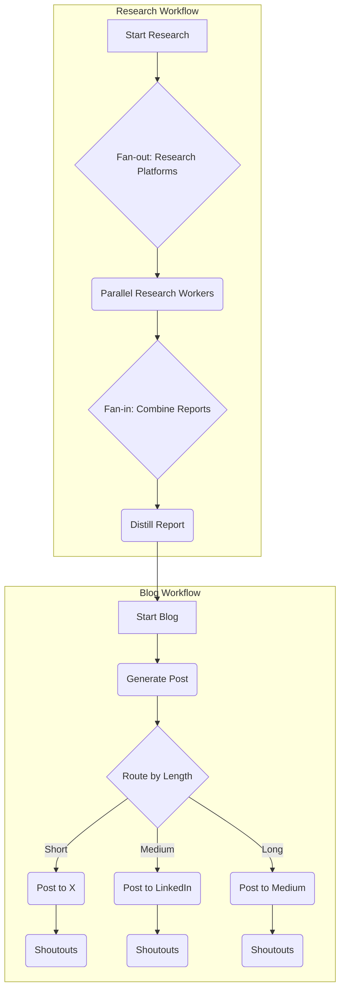

# Advanced Writer Workflow

This sample demonstrates an advanced, multi-part workflow that performs research, generates a blog post, and publishes it to the most appropriate platform.

## 1. Architecture

This sample is composed of three nested `WorkflowAgent`s:

- **`root_agent`**: The main orchestrator that runs the two sub-workflows in sequence.
- **`research_workflow`**: This workflow takes a topic, researches it across multiple platforms in parallel, and distills the findings into a single report.
- **`blog_workflow`**: This workflow takes the research report, generates a blog post, and then uses conditional routing to publish it to the best platform (X, LinkedIn, or Medium) based on the post's length. It then posts "shoutouts" to the other platforms.

This architecture demonstrates a realistic, complex use case combining sequential, parallel, and conditional execution.



## 2. Features Demonstrated

This sample showcases several advanced features of `WorkflowAgent`:

- **Nested Workflows**: The `root_agent` contains the `research_workflow` and `blog_workflow` as nodes in its graph, showing how to compose complex workflows from smaller, reusable ones.
- **Parallel Execution (Fan-out/Fan-in)**: The `research_workflow` uses a `ParallelWorker` to run the `research_worker_agent` across multiple platforms simultaneously.
- **Conditional Routing**: The `blog_workflow` uses a `route_changer` function to dynamically decide which publishing node to execute based on the word count of the generated blog post.

## 3. Deployment Guide

To deploy this workflow agent, you can use the `adk deploy` command.

### Prerequisites

Ensure you have authenticated with Google Cloud:
```sh
gcloud auth application-default login
```

Your GCP `project` and `location` should be set in a `.env` file in the root of this project.

### Deployment Command

```sh
adk deploy workflow-advanced_writer/agent.py:root_agent --display-name "Advanced Writing Agent"
```

After deployment, you can interact with the agent through the provided endpoint.

### Example Use

After deploying, you can invoke the agent with a topic to research and write about.

**Example Input:**
```json
{
  "input": "The impact of remote work on the tech industry"
}
```
The agent will then execute the full research and publishing workflow based on this topic.
