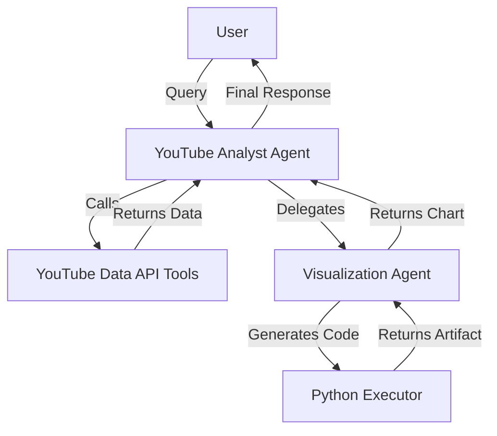

# YouTube Analyst Agent

The YouTube Analyst Agent is a powerful Gemini-powered assistant designed to provide deep insights into YouTube content, channel performance, and audience engagement. It leverages the YouTube Data API to retrieve real-time data and uses Gemini's reasoning capabilities to analyze trends, sentiment, and metrics.

## Demo

[](https://www.youtube.com/watch?v=PEKMLi52OzM)

*Click the image above to watch the agent in action.*

---

## Overview

This agent assists marketers, content creators, and researchers in understanding the YouTube landscape. It serves as a comprehensive demonstration of two key ADK capabilities:

1.  **Extensive YouTube API Integration:** Demonstrates how to orchestrate multiple complex API calls (search, video details, channel stats, comments) into a seamless conversational flow.
2.  **Interactive Visualizations with ADK:** Showcases the use of a specialized sub-agent to dynamically generate and execute Python code to produce interactive Plotly charts as artifacts within the ADK environment.

### Architecture



## Agent Details

| Feature | Description |
| --- | --- |
| **Interaction Type:** | Conversational / Analytics |
| **Complexity:**  | Intermediate |
| **Agent Type:**  | Multi-Agent (Root + Visualization Sub-Agent) |
| **Components:**  | YouTube Data API, ADK Tools, Interactive Plotly Charts |
| **Vertical:**  | Marketing / Media Analytics |

### Component Details

*   **Agents:**
    *   `youtube_agent` (Root): The main orchestrator that handles user queries, YouTube data retrieval, and analysis tasks.
    *   `visualization_agent` (Sub-agent): Specialized in generating Python code to create interactive Plotly charts based on data provided by the root agent.

*   **Tools:**
    *   `search_youtube`: Finds videos matching specific queries and date filters.
    *   `get_video_details`: Retrieves comprehensive stats (views, likes, comments) for video IDs.
    *   `get_channel_details`: Fetches subscriber counts and total view metrics for channels.
    *   `get_video_comments`: Downloads top-level comments for sentiment analysis.
    *   `calculate_engagement_metrics`: Computes engagement and active rates.
    *   `analyze_sentiment_heuristic`: Performs keyword-based sentiment scoring on text.
    *   `render_html`: Renders HTML content (used for reports).
    *   `execute_visualization_code`: Executes generated plotting code to produce artifacts.

## Setup and Installation

### Folder Structure
```
youtube-analyst/
├── README.md                 # Documentation
├── pyproject.toml            # Dependencies and configuration
├── .env                      # Environment variables (credentials)
└── youtube_analyst/          # Main Package
    ├── __init__.py
    ├── agent.py              # Main Agent logic
    ├── config.py             # Configuration loader
    ├── tools.py              # YouTube API tools
    ├── visualization_agent.py # Sub-agent for charting
    ├── visualization_tools.py # Tools for code execution & plotting
    └── prompts/              # System instructions
```

### Prerequisites

- Python 3.11+
- [uv](https://github.com/astral-sh/uv) (for dependency management)
- Google Cloud Project (with Vertex AI enabled)
- [YouTube Data API Key](https://developers.google.com/youtube/v3/getting-started)

### Installation

1.  **Clone the repository and navigate to the agent:**
    ```bash
    cd python/agents/youtube-analyst
    ```

2.  **Install dependencies:**
    ```bash
    uv sync
    ```

3.  **Configure Environment:**
    Create a `.env` file in the `youtube-analyst` directory:
    ```bash
    GOOGLE_CLOUD_PROJECT=your-project-id
    GOOGLE_CLOUD_LOCATION=global
    GOOGLE_GENAI_USE_VERTEXAI=1
    GOOGLE_API_KEY=your-youtube-data-api-key
    ```

## Usage

### Running in CLI
Interact with the agent directly in your terminal:
```bash
uv run adk run youtube_analyst
```

### Running with Web UI
For a richer experience with interactive charts:
```bash
uv run adk web
```
*Select `youtube_analyst` from the dropdown menu.*

## Example Interactions

- **Trend Analysis:** "Find the top 5 videos about 'Generative AI' from the last month and plot their view counts."
- **Competitor Research:** "Compare the engagement rates of MKBHD and Linus Tech Tips."
- **Audience Feedback:** "What is the sentiment of the comments on the latest OpenAI video? Summarize the top concerns."
- **Visual Reporting:** "Create a bar chart comparing the subscriber counts of the top 3 tech reviewers."

### Sample Trace (Under the Hood)

Here is what happens when you ask: *"Compare the engagement on the latest video from Running HK."*

```text
[User]: Compare the engagement on the latest video from Running HK.

[youtube_agent]: Calling tool `search_youtube`...
Arguments: {"query": "Running HK", "max_results": 1}

[Tool Output]: [{"title": "HK100 2024 Highlights", "videoId": "AbCdEfGhIjK", "channelTitle": "Running HK"}]

[youtube_agent]: Calling tool `get_video_details`...
Arguments: {"video_ids": ["AbCdEfGhIjK"]}

[Tool Output]: [{"videoId": "AbCdEfGhIjK", "viewCount": "50000", "likeCount": "2500", "commentCount": "150", ...}]

[youtube_agent]: Calling tool `calculate_engagement_metrics`...
Arguments: {"view_count": 50000, "like_count": 2500, "comment_count": 150}

[Tool Output]: {"engagement_rate": 5.3, "active_rate": 0}

[youtube_agent]: The latest video from Running HK has an engagement rate of 5.3%. Would you like me to visualize this against other running KOLs?
```

## Troubleshooting

- **API Errors:** If you see "Quota Exceeded" or 403 errors, ensure your `GOOGLE_API_KEY` is valid and has the YouTube Data API v3 enabled in the Google Cloud Console.
- **Visualization Failures:** If a chart fails to render, ask the agent to "try again" or "check the data format." The visualization agent writes code dynamically, and sometimes a retry fixes syntax issues.
- **Empty Results:** If searches return nothing, try broadening your query or removing date filters.

## Customization

- **Add New Metrics:** Extend `tools.py` to calculate custom metrics like "views per subscriber" or "comment-to-like ratio."
- **Enhance Sentiment:** Replace the heuristic sentiment tool in `tools.py` with a call to the Gemini API for more nuanced analysis of comments.
- **Database Integration:** Modify `tools.py` to save analysis results to BigQuery or a local SQL database for long-term tracking.

## Authors

- Pili Hu
- Jasmine Tong
- Kun Wang

## Disclaimer

This agent sample is provided for illustrative purposes only and is not intended for production use. It serves as a basic example of an agent and a foundational starting point for individuals or teams to develop their own agents.

This sample has not been rigorously tested, may contain bugs or limitations, and does not include features or optimizations typically required for a production environment.

Users are solely responsible for any further development, testing, security hardening, and deployment of agents based on this sample. We recommend thorough review, testing, and the implementation of appropriate safeguards before using any derived agent in a live or critical system.