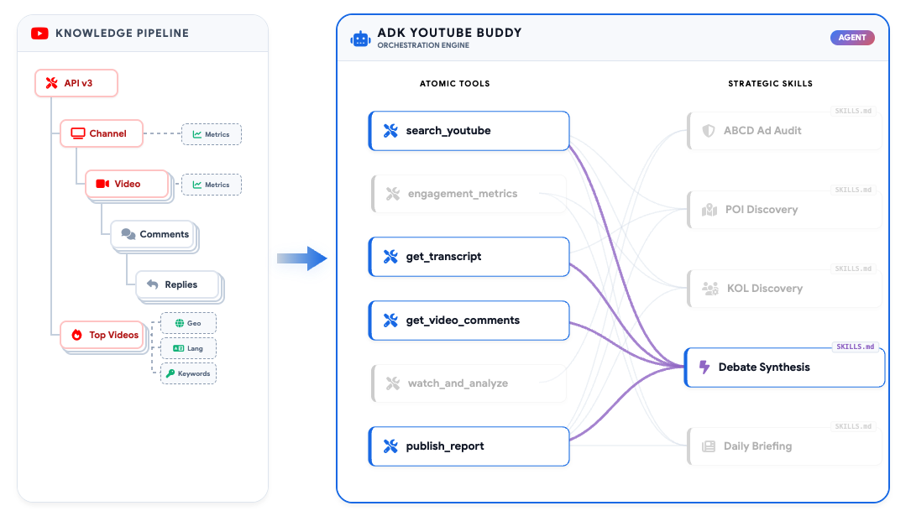

# YouTube Analyst Agent

The YouTube Analyst Agent is a powerful Gemini-powered assistant designed to provide deep insights into YouTube content, channel performance, and audience engagement. It leverages the YouTube Data API to retrieve real-time data and uses Gemini's reasoning capabilities to analyze trends, sentiment, and metrics.

## 🚀 Quick Start (Agent Starter Pack)

To create a production-ready project based on this agent, run the following command:

```bash
uvx agent-starter-pack create my-youtube-analyst -a adk@youtube-analyst
```

This will set up a complete project with:
*   **Infrastructure:** Terraform scripts for Google Cloud resources.
*   **CI/CD:** Automated deployment pipelines (Cloud Build or GitHub Actions).
*   **Management:** Built-in scripts for deployment and verification.

---

## Demo

[](https://www.youtube.com/watch?v=PEKMLi52OzM)

*Click the image above to watch the agent in action.*

---

## Overview

This agent assists marketers, content creators, and researchers in understanding the YouTube landscape. It serves as a comprehensive demonstration of two key ADK capabilities:

1.  **Extensive YouTube API Integration:** Demonstrates how to orchestrate multiple complex API calls (search, video details, channel stats, comments) into a seamless conversational flow.
2.  **Interactive Visualizations with ADK:** Showcases the use of a specialized sub-agent to dynamically generate and execute Python code to produce interactive Plotly charts as artifacts within the ADK environment.

### Architecture



## Agent Details

| Feature | Description |
| --- | --- |
| **Interaction Type:** | Conversational / Analytics |
| **Complexity:**  | Intermediate |
| **Agent Type:**  | Multi-Agent (Root + Visualization Sub-Agent) |
| **Components:**  | YouTube Data API, ADK Tools, Interactive Plotly Charts |
| **Vertical:**  | Marketing / Media Analytics |

### Component Details

*   **Agents:**
    *   `youtube_agent` (Root): The main orchestrator that handles user queries, YouTube data retrieval, and analysis tasks.
    *   `visualization_agent` (Sub-agent): Specialized in generating Python code to create interactive Plotly charts based on data provided by the root agent.

*   **Tools:**
    *   `search_youtube`: Finds videos matching specific queries and date filters.
    *   `get_video_details`: Retrieves comprehensive stats (views, likes, comments) for video IDs.
    *   `get_channel_details`: Fetches subscriber counts and total view metrics for channels.
    *   `get_video_comments`: Downloads top-level comments for sentiment analysis.
    *   `calculate_engagement_metrics`: Computes engagement and active rates.
    *   `analyze_sentiment_heuristic`: Performs keyword-based sentiment scoring on text.
    *   `render_html`: Renders HTML content (used for reports).
    *   `execute_visualization_code`: Executes generated plotting code to produce artifacts.
    *   `store_youtube_api_key`: Stores the user-provided API key for the session.

## Setup and Installation

### Folder Structure
```
youtube-analyst/
├── README.md                 # This file
├── pyproject.toml            # Dependencies and project configuration
├── Makefile                  # Automation for install, check, test, and web UI
├── .env.example              # Template for environment variables
├── tests/                    # Unit and integration tests
└── youtube_analyst/          # Main agent package
    ├── __init__.py           # Environment initialization
    ├── agent.py              # Agent and sub-agent definition
    ├── config.py             # Configuration loader
    ├── tools.py              # YouTube API and utility tools
    ├── visualization_agent.py # Visualization sub-agent logic
    ├── visualization_tools.py # Tools for code execution
    ├── skills/               # Modular skill sets
    └── prompts/              # System instructions (RoA philosophy)
```

### Prerequisites

- **Python 3.13**: The project is pinned to this version for stability and feature compatibility.
- [uv](https://docs.astral.sh/uv/): Used for fast dependency management and virtual environment creation.
- **Google Cloud Project**: Required for Vertex AI and Gemini model access.
- **YouTube Data API key**: You will be prompted to provide this in the chat during your first interaction.

### Installation (Local Development)

1.  **Clone the repository:**
    ```bash
    git clone https://github.com/google/adk-samples.git
    cd adk-samples/python/agents/youtube-analyst
    ```

2.  **Install the environment:**
    ```bash
    make install
    ```

3.  **Configure Credentials:**
    ```bash
    cp .env.example .env
    ```
    Edit `.env` and set `GOOGLE_CLOUD_PROJECT` and `GOOGLE_CLOUD_LOCATION=global`.

### Running the Agent

**Web Interface (Recommended):**
```bash
make web
```
Select `youtube_analyst` from the agent selection menu.

**Command Line Interface:**
```bash
make cli
```

### Deployment (Advanced)

For users who want to deploy the agent as a managed service, we provide automated deployment scripts that rely on the [Agent Starter Pack (ASP)](https://goo.gle/agent-starter-pack).

- **Deploy to Vertex AI Agent Engine:**
  ```bash
  ./deployment/deploy-to-agent-engine.sh
  ```
- **Deploy to Google Cloud Run:**
  ```bash
  ./deployment/deploy-to-cloud-run.sh
  ```
- **Deploy to Gemini Enterprise:**
  ```bash
  ./deployment/deploy-to-gemini-enterprise.sh
  ```

*Note: These scripts use `uvx` and have built-in hermetic safeguards (`UV_NO_CONFIG=1`) to ensure reliable installation of the required deployment tools from the public PyPI registry.*

---

## Onboarding: YouTube API Key

This agent requires a YouTube Data API v3 key. To maintain security and allow for frictionless setup, YouBuddy features an interactive onboarding flow:

1.  Apply for a key at [Google Developers Console](https://developers.google.com/youtube/v3/getting-started).
2.  When the agent detects a missing key, it will provide instructions.
3.  Paste your key into the chat.
4.  The agent securely stores the key in the session state using the `store_youtube_api_key` tool.

## Example Interactions

- **Trend Analysis:** "Find the top 5 videos about 'Generative AI' from the last month and plot their view counts."
- **Competitor Research:** "Compare the engagement rates of MKBHD and Linus Tech Tips."
- **Audience Feedback:** "What is the sentiment of the comments on the latest OpenAI video? Summarize the top concerns."
- **Visual Reporting:** "Create a bar chart comparing the subscriber counts of the top 3 tech reviewers."

### Sample Trace (Under the Hood)

Here is what happens when you ask: *"Compare the engagement on the latest video from Running HK."*

```text
[User]: Compare the engagement on the latest video from Running HK.

[youtube_agent]: Calling tool `search_youtube`...
Arguments: {"query": "Running HK", "max_results": 1}

[Tool Output]: [{"title": "HK100 2024 Highlights", "videoId": "AbCdEfGhIjK", "channelTitle": "Running HK"}]

[youtube_agent]: Calling tool `get_video_details`...
Arguments: {"video_ids": ["AbCdEfGhIjK"]}

[Tool Output]: [{"videoId": "AbCdEfGhIjK", "viewCount": "50000", "likeCount": "2500", "commentCount": "150", ...}]

[youtube_agent]: Calling tool `calculate_engagement_metrics`...
Arguments: {"view_count": 50000, "like_count": 2500, "comment_count": 150}

[Tool Output]: {"engagement_rate": 5.3, "active_rate": 0}

[youtube_agent]: The latest video from Running HK has an engagement rate of 5.3%. Would you like me to visualize this against other running KOLs?
```

## Customization

- **Add New Metrics:** Extend `tools.py` to calculate custom metrics like "views per subscriber" or "comment-to-like ratio."
- **Enhance Sentiment:** Replace the heuristic sentiment tool in `tools.py` with a call to the Gemini API for more nuanced analysis of comments.
- **Database Integration:** Modify `tools.py` to save analysis results to BigQuery or a local SQL database for long-term tracking.

## Troubleshooting

- **API Errors:** If you see "Quota Exceeded" or 403 errors, ensure your key is valid and has the YouTube Data API v3 enabled.
- **Python Version**: If `uv sync` fails, ensure you have Python 3.13 installed (e.g., via `pyenv` or `brew install python@3.13`).
- **Visualization Failures:** If a chart fails to render, ask the agent to "try again." The visualization agent writes code dynamically, and a retry often fixes syntax issues.

## Authors

- Pili Hu
- Jasmine Tong
- Kun Wang
- Jeff Yang

## Disclaimer

This agent sample is provided for illustrative purposes only and is not intended for production use. It serves as a basic example of an agent and a foundational starting point for individuals or teams to develop their own agents.

This sample has not been rigorously tested, may contain bugs or limitations, and does not include features or optimizations typically required for a production environment.

Users are solely responsible for any further development, testing, security hardening, and deployment of agents based on this sample. We recommend thorough review, testing, and the implementation of appropriate safeguards before using any derived agent in a live or critical system.
